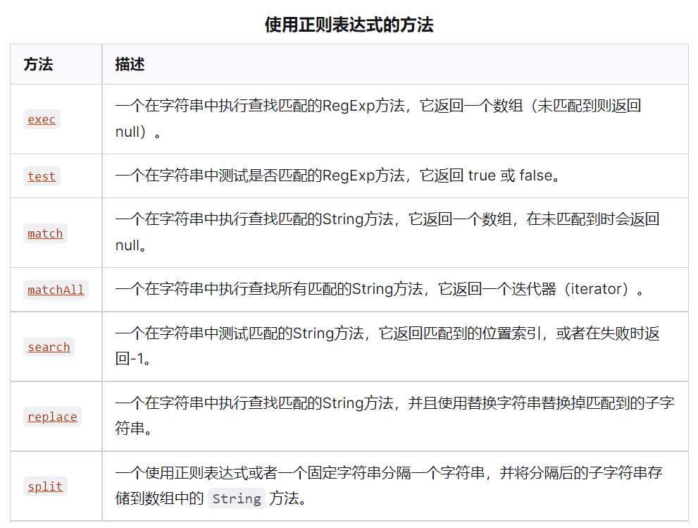

# 正则表达式

## 1、介绍
`正则表达式`可以看做是一种用来描述字符串`模式匹配`规则的协议，通过遵循这种协议的语义，我们向正则解析引擎描述自己需要找出什么样的子串。

::: tip
正则表达式的底层实现原理十分复杂（事实上就是仅仅学会正则的用法都不能算是简单的事情），但可以肯定的一点是，正则模式匹配的平均效率一定比所有你能想到的模型匹配算法要高效得多，所以 **Just use it！**
:::

## 2、体验
前端验证密码复杂性是正则表达式十分重要的使用场景，我们直接从一个实际问题上手，验证用户设置的密码必须满足以下规则：
- 同时包含数字、大小写字母和特殊字符。
- 长度不低于8位。

在表单验证场景下，这算比较基础的问题，但时如果不使用正则而纯粹手写验证逻辑却几乎难以下手。
下面直接给出我想到的一种正则模式：**`^(?=.*\d)(?=.*[a-z])(?=.*[A-Z])(?=.*[^\da-zA-Z\s]).{8,}$`**。
现在看不懂没关系，毕竟我也刚学会，但我保证你看完后面的章节能和我一样牛逼。
### (1) 在JS中使用
顺便先说下有了正则表达式应该怎么去使用，正则表达式本身在各种语言是通用的，只是调用的`api`略有差异。
在JS中直接通过字面量（`/我是正则/`）或者使用构造函数（`new RegExp("我是正则")`）两种方式定义都可以。


> 其中`exex`和`test`是`RegExp`对象的方法，其余是`string`的方法。


比如上面验证密码的可以封装到一个函数里：

```js
function check(password){
  let re = /^(?=.*\d)(?=.*[a-z])(?=.*[A-Z])(?=.*[^\da-zA-Z\s]).{8,}$/
  return re.test(password)  
}

check('1Password.') // true
```
:::warning
一般情况下建议不要使用`new RegExp()`传入字符串的方式来声明正则对象，因为正则里有太多使用`\`作为前缀的转义字符表示，而字符串本身也有转义符号，且两者根本不兼容。举个栗子，`\s`在正则里用来匹配空白字符（包括空格、tab、换行），如果我们写成`new RegExp("\s")`，js引擎会直接当作我们写的是`new RegExp("s")`，因为字符串里根本没有`\s`这种转义，所以直接就帮我们删掉了，那怎么解决呢？就是必须再转义一次写成`new RegExp("\\s")`，当转义较多时这样很容易出错，而使用字面量的方式直接用`/\s/`就行了。
:::

## 3、基本匹配
### (1) 普通字符
一个普通字符单元用来匹配`一个`真实的字符。

| 表示   | 描述                                           |
| ------ | ---------------------------------------------- |
| [ABC]  | 匹配 [...] 中任一字符                          |
| [^ABC] | 匹配 [...] 以外的任一字符                      |
| [A-Z]  | 匹配区间A-Z中任一字符                          |
| \d     | 匹配数字                                       |
| \D     | 匹配非数字                                     |
| \n     | 匹配换行符                                     |
| \r     | 匹配回车符                                     |
| .      | 匹配除了换行和回车以外的任一字符               |
| \s     | 匹配空白符，包括空格、制表符、换页符和换行符   |
| \S     | 匹配非空白符                                   |
| \w     | 匹配任一字母、数字或下划线，等价于[0-9a-zA-Z_] |
### (2) 限定符
限定符用于限制前面字符单元（字符或表达式）出现的次数。
| 表示 | 描述                          |
| ---- | ----------------------------- |
| ?    | 修饰前面的表达式出现0次或1次  |
| +    | 修饰前面的表达式出现1次或多次 |
| *    | 修饰前面的表达式出现任意次    |
| {}   | 匹配次数限定符                |
:::tip
`+`和`*`默认开启贪婪匹配，在其用添加`?`可开启非贪婪模式。
:::
### (3) 定位符
定位符本身不匹配真实的字符，而是限制匹配的开始和结束位置。
| 表示 | 描述                                   |
| ---- | -------------------------------------- |
| ^    | 匹配输入字符串开始的位置               |
| $    | 匹配输入字符串结尾的位置               |
| \b   | 匹配一个单词边界，即字与空格间的位置。 |
| \B   | 匹配非单词边界                         |

## 4、高级匹配
### (1) 捕获
`()`用来修饰一个字符表达式，同时会产生附加的捕获效果，可以在后面引用前面的捕获的内容，如`/(...)\1/`。
除此之外在`()`内部匹配的结果会被缓存下来。
```js
let str = "123a456b"
let res = str.match(/([0-9]+)([a-z])/g)
console.log(res)  // ['123a', '456b']
```
>`g`是修饰符代表全局匹配。
如果只是为了构造表达式不希望有缓存效果（只为了检验），可以使用`(?:)`消除缓存效果。
### (2) 断言
其实定位符也算是一种断言，是一种对位置的断言。这里要说的断言更像一种广义的判断，满足继续、不满足终止。
| 表示   | 描述           |
| ------ | -------------- |
| (?=)   | 正向满足前进   |
| (?!)   | 正向不满足前进 |
| (?<=)  | 逆向满足前进   |
| (?<!>) | 逆向不满足前进 |
:::tip
目前来看我觉得这是正则里最不容易理解的内容，也是十分强大的功能，文章最开始的密码验证的关键就是使用断言描述。事实上只需要正向断言就能解决所有问题，为了避免混淆，可以尽量只使用一个方向的断言。
:::
为什么`/^(?=.*\d)(?=.*[a-z])(?=.*[A-Z])(?=.*[^\da-zA-Z\s]).{8,}$/`可以用来检验字符串满足：
- 同时包含数字、大小写、特殊字符
- 至少8位

这里使用的正向满足断言，即在`^`匹配后（字符串一旦起始）开始逐个断言，首先是要匹配一个以数字结束的子串，关键的地方在于断言是`非捕获`的，即一旦判断成功就相当于逐个断言从未存在过一样，不会影响后面的任何匹配，之后继续判断以小写字母结尾、以大写字母结尾、以特殊符号结尾，如果断言都成功说明真的存在这些类型的字符，最后我们还要满足位数的要求。至此就写好的。
断言就是这样强大，其非捕获的特性使其可以有`且`的效果，又不影响后续的判断。
逆向断言同理，就是说我匹配后再向前去断言。
### (3) 修饰符
**/pattern/flags**
| 修饰符 | 含义                   |
| ------ | ---------------------- |
| i      | ignore: 忽略大小写     |
| g      | global: 全局匹配       |
| m      | mutipal-line: 多行匹配 |
| s      | 开启`.`包含换行符      |
## 5、相关资源
- [regex101在线测试工具](https://regex101.com/)
- [MDN文档](https://developer.mozilla.org/zh-CN/docs/Web/JavaScript/Guide/Regular_Expressions)
- [菜鸟教程](https://www.runoob.com/regexp/regexp-intro.html)
- [github文档](https://github.com/cdoco/learn-regex-zh)
  
🎉🎉🎉