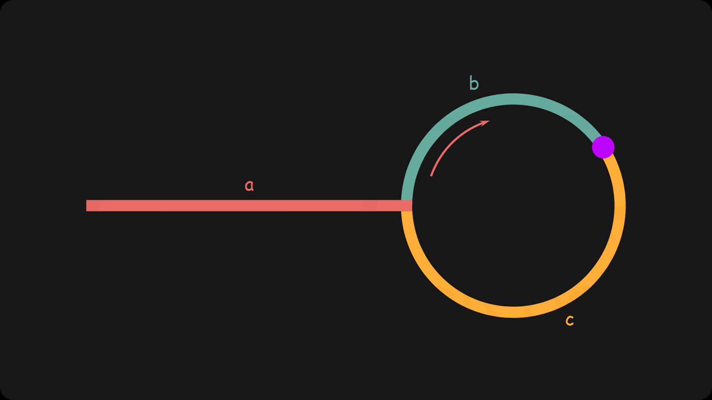

# 第 1 章 链表

> 不用`递归`和`双指针`你就输了。事实上要先考虑双指针，太麻烦再去考虑链表。

## [2] 两数相加

`中等`
对于 leetcode 链表问题一定要想好怎么规避掉边际条件，不然一堆的边际判断会很难受。这里我结果用的`新的链表`就是这个原因，同时也不会污染原来的数据。我不需要手动控制哪个链表到终点了，用三元运算符一直让程序自己去判断。
值得注意的是结果返回的是`res.next`，这样就不必在之后每次先创建好节点再去修改值。

```js
var addTwoNumbers = function (l1, l2) {
  let res = new ListNode();
  let sum = 0,
    up = 0,
    p = res;
  while (l1 || l2) {
    sum = (l1 ? l1.val : 0) + (l2 ? l2.val : 0) + up;
    if (sum > 9) up = 1;
    else up = 0;
    p.next = new ListNode(sum % 10, null);
    p = p.next;
    l1 = l1 ? l1.next : null; // 注意这里的判断条件是l1，而不是l1.next
    l2 = l2 ? l2.next : null;
  }
  if (up) {
    p.next = new ListNode(1, null);
  }
  return res.next;
};
```

## [21] 合并两个有序链表

这是个头递归问题，因为每次比较后得到的较小的那个节点并不知道该指向谁，即当前递归的操作本身依赖于下次递归执行的结果。当然不使用递归也能解决，自己去构造新的链表出来。当你觉得问题简单，但操作起来比较棘手时，很可能递归就是最好的方案。

```js
var mergeTwoLists = function (list1, list2) {
  if (list1 === null) return list2;
  if (list2 === null) return list1;
  if (list1.val <= list2.val) {
    list1.next = mergeTwoLists(list1.next, list2);
    return list1;
  } else {
    list2.next = mergeTwoLists(list1, list2.next);
    return list2;
  }
};
```

## [23] 合并 k 个有序链表

有两个方法，`优先队列`和`分治法`，下面使用的优先队列，值得注意的是，这里并没有把链表所有节点摘出来放到优先队列，而是只把链表的 head 放进去，足够找到当前的最小值了。

```java
class Solution {
    public ListNode mergeKLists(ListNode[] lists) {
        if (lists.length == 0) {
            return null;
        }
        ListNode dummyHead = new ListNode(0);
        ListNode curr = dummyHead;
        PriorityQueue<ListNode> pq = new PriorityQueue<>(new Comparator<ListNode>() {
            @Override
            public int compare(ListNode o1, ListNode o2) {
                return o1.val - o2.val;
            }
        });
        for (ListNode list : lists) {
            if (list == null) {
                continue;
            }
            pq.add(list);
        }
        while (!pq.isEmpty()) {
            ListNode nextNode = pq.poll();
            curr.next = nextNode;
            curr = curr.next;
            if (nextNode.next != null) {
                pq.add(nextNode.next);
            }
        }
        return dummyHead.next;
    }
}
```

## [25] K 个一组翻转链表

这个是**206.反转链表**的进阶版，重点是要把若干段反转后的链表拼接起来，需要小心一点。还有这里说最后少于 k 的段不反转了，所以反转之前还要事先判断下。

> 给第一段的 head 加个 hair 使得行为一致。

```js
const myReverse = (head, tail) => {
  let prev = tail.next;
  let p = head;
  while (prev !== tail) {
    const nex = p.next;
    p.next = prev;
    prev = p;
    p = nex;
  }
  return [tail, head];
};
var reverseKGroup = function (head, k) {
  const hair = new ListNode(0);
  hair.next = head;
  let pre = hair;

  while (head) {
    let tail = pre;
    // 查看剩余部分长度是否大于等于 k
    for (let i = 0; i < k; ++i) {
      tail = tail.next;
      if (!tail) {
        return hair.next;
      }
    }
    const nex = tail.next;
    [head, tail] = myReverse(head, tail);
    // 把子链表重新接回原链表
    pre.next = head;
    tail.next = nex;
    pre = tail;
    head = tail.next;
  }
  return hair.next;
};
```

## [141] 环形链表

### 递归标记法

```js
var hasCycle = function (head) {
  if (head == null || head.next == null) return false;
  if (head.val === null) return true;
  head.val = null;
  return hasCycle(head.next);
};
```

十分简介，但坏处时把链表的数据都给毁掉了，或者会引入污染属性。

### 快慢指针法

快指针走两步，慢指针走一步，有环必然相遇。

```js
var hasCycle = function (head) {
  let slow = head,
    fast = head;
  while (slow != null && fast != null && fast.next != null) {
    slow = slow.next;
    fast = fast.next.next;
    if (slow == fast) return true;
  }
  return false;
};
```

### Map 法

js 的 Map 本身就有 hash 的用法：

```js
var hasCycle = function (head) {
  let p = head,
    map = new Map();
  while (p && p.next) {
    if (map.get(p)) return true;
    map.set(p, true);
    p = p.next;
  }
  return false;
};
```

但是测试后发现这个效率很低。原因在于 js 的 Map 不是通过 hash 实现的，而是两个分别保存键和值的数组，每次搜索都要遍历整个数组，第一次见这么鸡肋的 api。

> js 没有实现`hashMap`...

## [142] 环形链表 II

题目和前面一样，但要求返回入环的位置。


根据 slow 和 fast 走过的距离和两者关系可得到关于 a 的式子：`a=c+(n−1)(b+c)`，表示 a 与 c 相差环长度的整数倍。若有另一个指针 ptr 从 head 与 slow 同时开始走，恰在入环点相遇。

```js
var detectCycle = function (head) {
  if (head === null) {
    return null;
  }
  let slow = head,
    fast = head;
  while (fast !== null) {
    slow = slow.next;
    if (fast.next !== null) {
      fast = fast.next.next;
    } else {
      return null;
    }
    if (fast === slow) {
      let ptr = head;
      while (ptr !== slow) {
        ptr = ptr.next;
        slow = slow.next;
      }
      return ptr;
    }
  }
  return null;
};
```

## [160] 相交链表

当你走到终点时，开始走她走过的路，
当她走到终点时，开始走你走过的路，
若是有缘，你们一定会相遇。

```js
var getIntersectionNode = function (headA, headB) {
  if (!headA || !headB) {
    return null;
  }

  let a = headA,
    b = headB;
  while (a != b) {
    a = a == null ? headB : a.next;
    b = b == null ? headA : b.next;
  }
  return a;
};
```

## [206] 反转链表

### 递归解法

对于任一节点，只需要考虑把它的 next 指向它的前一个元素，其他的不用它管。于是递归函数需要传递的是当前节点以及它的 next 应该指向的节点。这个递归本质上是个尾递归，不算难理解。递归就不应该想太多。
考虑好以下三点直接开写：

- 出口是什么？
- 每一次递归应该处理什么？
- 每次递归需要什么？

```js
var reverseList = function (head, p = null) {
  if (!head) return head;
  const next = head.next;
  head.next = p;
  return next ? reverseList(next, head) : head;
};
```

### 双指针解法

所有链表问题都能用指针来解，且理解起来比递归更直观。
不停地换指针，处理好边界条件即可。

```js
var reverseList = function (head) {
  let cur = head;
  let pre = null;
  while (cur) {
    let next = cur.next;
    cur.nextt = pre;
    pre = cur;
    cur = next;
  }
  return pre;
};
```
