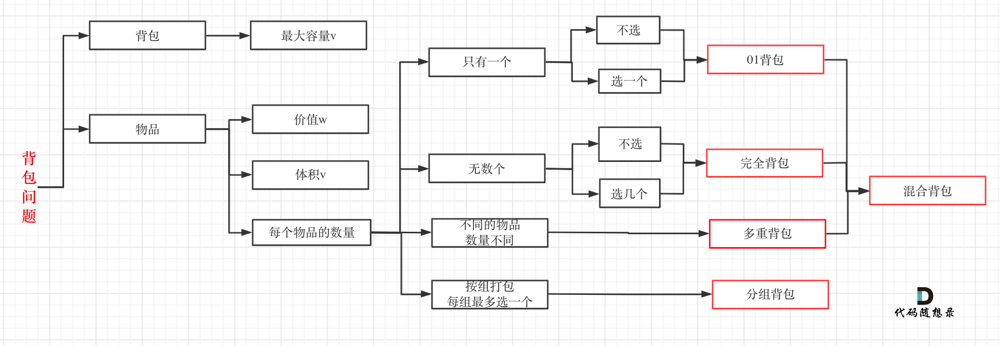

# 第 6 章 动态规划

**动态规划中每一个状态一定是由上一个状态推导出来的，这一点就区分于贪心，贪心没有状态推导，而是从局部直接选最优的，即局部最优能推导出全局最优。**

五部曲：

- 确定 dp 数组（dp table）以及下标的含义
- 确定递推公式
- dp 数组如何初始化
- 确定遍历顺序
- 举例推导 dp 数组

这不是动态规划问题，就是单纯的迭代，我懒得改了，事实上三个变量来回倒腾`n-2`轮就出来了。

## 1、基础问题

### [70] 爬楼梯问题

每步爬 1 级台阶或者 2 级台阶，问 n 级楼梯有多少种爬法？
所有爬法分为两类，第一类最后一步爬了 1 级，另一类最后一步爬了 2 级，这是经典的斐波那契数列模型：**f(n)=f(n-1)+f(n-2)**

```js
var climbStairs = function (n) {
  let dp = new Array(n + 1);
  dp[0] = dp[1] = 1;
  for (let i = 2; i <= n; i++) {
    dp[i] = dp[i - 1] + dp[i - 2];
  }
  return dp[n];
};
```

> 只用 a 和 b 就足够存储了

### [746] 使用最小花费爬楼梯

注意这个 dp 数字表示的含义是：到达当前台阶且继续往下走的最小花费

```js
var minCostClimbingStairs = function (cost) {
  let dp = [cost[0], cost[1]],
    len = cost.length;
  for (let i = 2; i < len; i++) {
    dp[i] = Math.min(dp[i - 1], dp[i - 2]) + cost[i];
  }
  return Math.min(dp[len - 1], dp[len - 2]);
};
```

### [62] 不同路径

这个是个二维的 dp 问题。
dp 数组的含义为到达当前位置的路径数量，我们注意到每一个位置都只能从其左边和上边到达。这样递推公式就很简单了。
dp 初始化的是第一行和第一列。

```js
var uniquePaths = function (m, n) {
  let dp = Array.from(Array(m), () => Array(n).fill(1));
  for (let i = 1; i < m; i++) {
    for (let j = 1; j < n; j++) {
      dp[i][j] = dp[i - 1][j] + dp[i][j - 1];
    }
  }
  return dp[m - 1][n - 1];
};
```

### [63] 不同路径 II

当存在障碍物时，主要变化就是在 dp 初始化的时候，如果遇到障碍物后边的都是不可达的。

```js
var uniquePathsWithObstacles = function (obstacleGrid) {
  let m = obstacleGrid.length,
    n = obstacleGrid[0].length;
  let dp = Array.from(Array(m), () => Array(n).fill(0));
  for (let i = 0; i < m; i++) {
    if (obstacleGrid[i][0] === 1) break;
    dp[i][0] = 1;
  }
  for (let i = 0; i < n; i++) {
    if (obstacleGrid[0][i] === 1) break;
    dp[0][i] = 1;
  }
  for (let i = 1; i < m; i++) {
    for (let j = 1; j < n; j++) {
      dp[i][j] = obstacleGrid[i][j] === 1 ? 0 : dp[i - 1][j] + dp[i][j - 1];
    }
  }
  return dp[m - 1][n - 1];
};
```

### [343] 整数拆分

```js
var integerBreak = function (n) {
  let dp = Array(n + 1).fill(0);
  // 任意数 i，拆分为 j 和 i-j，i-j也可以选择拆分。选择最大的结果即可
  for (let i = 2; i <= n; i++) {
    for (let j = 1; j < i; j++) {
      dp[i] = Math.max(dp[i], dp[i - j] * j, (i - j) * j);
    }
  }
  return dp[n];
};
```

## 2、背包问题

`01背包`和`完全背包`是必须掌握的。


## 3、打家劫舍

## 4、股票问题

## 5、子序列问题

## [647] 回文子串

搜索所有回文子串的数量，如果暴力判断任意子串，复杂度为`O(n^3)`，我们注意到对于`s[i]`==`s[j]`，如果`i`到`j`想要是回文串，只需要`i+1`到`j-1`是回文的就可以了，这就是一个递推的过程：

```js
var countSubstrings = function (s) {
  let dp = Array.from(Array(s.length), () => Array(s.length).fill(false));
  let ans = 0;
  for (let i = s.length - 1; i >= 0; i--) {
    for (let j = i; j < s.length; j++) {
      if (s[i] == s[j]) {
        if (j - i <= 1) {
          dp[i][j] = true;
          ans++;
        } else {
          if (dp[i + 1][j - 1]) {
            dp[i][j] = true;
            ans++;
          }
        }
      }
    }
  }
  return ans;
};
```

> 注意这里是怎么填充二维数组的，以及遍历的顺序。
