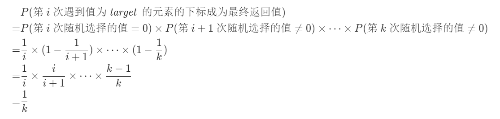

# 第 11 章 大数据量

## [398] 随机数索引

给你一个可能含有 重复元素 的整数数组 nums ，请你随机输出给定的目标数字 target 的索引。你可以假设给定的数字一定存在于数组中。
这里假设数组的长度非常大，如果使用 hash 法可以需要非常大的额外空间。
所以这里使用的是`鱼塘抽样`模型，遍历 nums，当我们第 i 次遇到值为 target 的元素时，随机选择区间 [0,i) 内的一个整数，如果其等于 0，则将返回值置为该元素的下标，否则返回值不变。设 nums 中有 k 个值为 target 的元素，该算法会保证这 k 个元素的下标成为最终返回值的概率均为 1/k。

证明如下：



```js
var Solution = function (nums) {
  this.nums = nums;
};

Solution.prototype.pick = function (target) {
  let ans = 0;
  for (let i = 0, cnt = 0; i < this.nums.length; ++i) {
    if (this.nums[i] == target) {
      ++cnt; // 第 cnt 次遇到 target
      if (Math.floor(Math.random() * cnt) === 0) {
        ans = i;
      }
    }
  }
  return ans;
};
```
