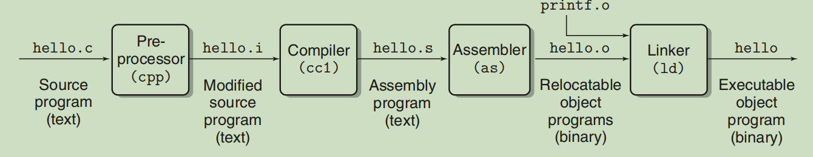
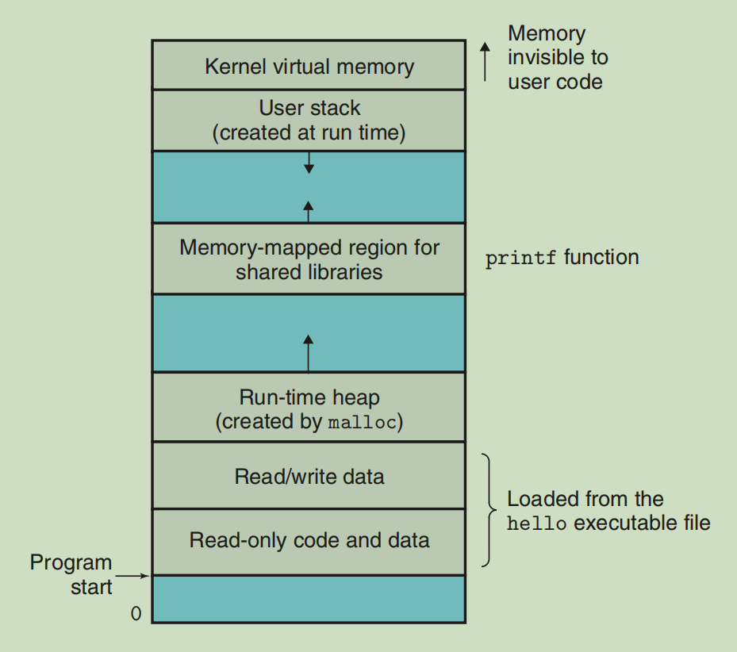

# A Tour of Computer System

## 1、Hello World

- 预处理阶段

  拼接`include`的其他头文件等，生成纯的c程序。

- 编译阶段

  生成汇编代码。

- 汇编阶段

  生成`relocatable`二进制目标程序。

- 链接阶段

  `merge`标准库程序。

## 2、Hardware

### Processor

The processor reads the instruction from memory pointed at by the `program counter` (PC), interprets the bits in the instruction, performs some simple operation dictated by the instruction, and then updates the PC to point to the next instruction, which may or may not be contiguous in memory to the instruction that was just executed.

The `register file` is a small storage device that consists of a collection of word-size registers, each with its own unique name.

## 3、Operating System

### Processes

The operating system keeps track of all the state information that the process needs in order to run. This state, which is known as the `context`, includes information such as the current values of the PC, the register file, and the contents of main memory.

### Threads

Threads are an increasingly important programming model because of the requirement for concurrency in `network servers`.

### Virtual Memory

Virtual memory is an abstraction that provides each process with the illusion that it has exclusive use of the main memory.

- Program code and data

- Heap

- Shared libraries

- Stack

  In particular, each time we call a `function`, the stack grows. Each time we return from a function, it contracts.

- Kernel virtual memory

The basic idea is to store the contents of a process’s virtual memory on disk and then use the main memory as a cache for the disk.

## 4、Concurrency and Parallelism

- Thread-Level

  多个`线程并行`。

- Instruction-Level

  流水线技术，因为指令都是由几个特定阶段组成，使得多个`指令并行`。

- Operations-Level

  指定的多个`操作并行`。
