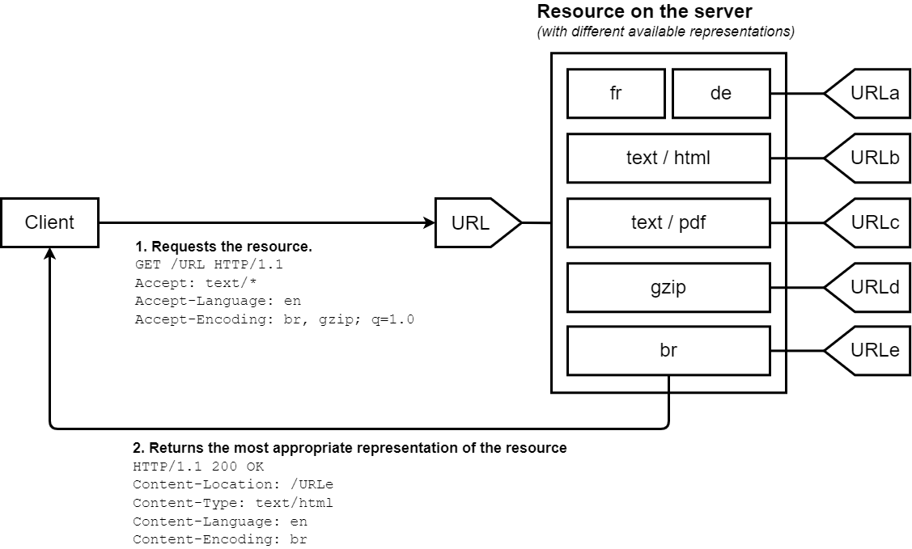

# HTTP

## 1、Request

### （1）请求行

Method + URI + Version

### （2）请求头

#### Accept

包括`Accept`、`Accept-Language`、`Accept-Encoding`、`Accept-Charset`等



#### Origin

用于跨域时表明预检请求或实际请求的源站。

#### Access-Control-Request-Method

#### Access-Control-Request-Headers

#### Authorization

`Authorization: <type> <credentials>`
一般可以用来携带`token`。

#### Referer

Referer 请求头包含了当前请求页面的来源页面的地址，即表示当前页面是通过此来源页面里的链接进入的。服务端一般使用 Referer 请求头识别访问来源，可能会以此进行统计分析、日志记录以及缓存优化等。
在以下两种情况下，Referer 不会被发送：

- 来源页面采用的协议为表示本地文件的 "file" 或者 "data" URI；
- 当前请求页面采用的是非安全协议，而来源页面采用的是安全协议（HTTPS）。

## 2、Response

### 响应行

响应行：version+status code+reason

### 响应头

#### Access-Control-Allow-Origin

`Access-Control-Allow-Origin: origin | *`

#### Access-Control-Expose-Headers

在跨源访问时，XMLHttpRequest 对象的 getResponseHeader() 方法只能拿到一些最基本的响应头，Cache-Control、Content-Language、Content-Type、Expires、Last-Modified、Pragma，如果要访问其他头，则需要服务器设置本响应头。

Access-Control-Expose-Headers 头让服务器把允许浏览器访问的头放入白名单，例如：

```text
Access-Control-Expose-Headers: X-My-Custom-Header, X-Another-Custom-Header
```

#### Access-Control-Max-Age

预检请求的缓存时间

#### Access-Control-Allow-Credentials

表示跨域请求的`凭证`是否支持被携带，对于简单请求会直接控制响应能否被接收，对于预检请求代表反馈的支持信息。

#### Access-Control-Allow-Methods

#### Access-Control-Allow-Headers

#### Allow

Allow 首部字段用于枚举资源所支持的 HTTP 方法的集合。若服务器返回状态码 405 Method Not Allowed，则该首部字段亦需要同时返回给客户端。如果 Allow 首部字段的值为空，说明资源不接受使用任何 HTTP 方法的请求。这是可能的，比如服务器需要临时禁止对资源的任何访问。

#### Cache-Control

通过指定指令来实现缓存机制。缓存指令是单向的，这意味着在请求中设置的指令，不一定被包含在响应中。

- public
- private
- no-cache：取消强缓存
- no-store：取消缓存
- max-age=second
- must-revalidate：一旦过期，在验证前不可用

配合`If-Modified-Since`使用。

#### ETag

配合`If-Match`和`If-None-Match`使用。

#### Expires

缓存过期时间，优先级低于`Cache-Control`

## 3、发展

### HTTP/0.9

只支持 GET，只支持响应 HTML

### HTTP/1.0

添加了大部分功能。
每个 TCP 连接只能发送一个请求。发送数据完毕，连接就关闭，如果还要请求其他资源，就必须再新建一个连接。每次都要经历一个慢启动的过程。

### HTTP/1.1

引入了持久连接（persistent connection），即 TCP 连接默认不关闭，可以被多个请求复用，不用声明`Connection: keep-alive`。客户端和服务器发现对方一段时间没有活动，就可以主动关闭连接。不过，规范的做法是，客户端在最后一个请求时，发送`Connection: close`，明确要求服务器关闭 TCP 连接。
1.1 版还引入了管道机制（pipelining）。以前的做法是，在同一个 TCP 连接里面，先发送 A 请求，然后等待服务器做出回应，收到后再发出 B 请求。管道机制则是允许浏览器同时发出 A 请求和 B 请求，但是服务器还是按照顺序，先回应 A 请求，完成后再回应 B 请求。

### HTTP/2

#### 多工

双向的、实时的通信，在一个 TCP 连接里面，服务器同时收到了 A 请求和 B 请求，于是先回应 A 请求，结果发现处理过程非常耗时，于是就发送 A 请求已经处理好的部分， 接着回应 B 请求，完成后，再发送 A 请求剩下的部分。

#### 数据流

HTTP/2 将每个请求或回应的所有数据包，称为一个数据流（stream）。每个数据流都有一个独一无二的编号。这就是说，HTTP/2 可以取消某一次请求，同时保证 TCP 连接还打开着，可以被其他请求使用。客户端还可以指定数据流的优先级。优先级越高，服务器就会越早回应。

#### 头信息压缩

一方面，头信息使用 gzip 或 compress 压缩后再发送；另一方面，客户端和服务器同时维护一张头信息表，所有字段都会存入这个表，生成一个索引号，以后就不发送同样字段了，只发送索引号，这样就提高速度了。

#### 服务器推送
HTTP/2 允许服务器未经请求，主动向客户端发送资源，这叫做服务器推送（server push）。