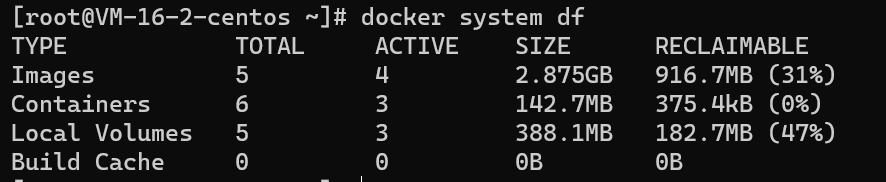

## 系统

### docker system df

系统空间占据



**`-v`**：查看详情。

## 镜像

### docker pull

从仓库拉取镜像。

## 容器

### docker run

```bash
docker run ubuntu:15.10 /bin/echo "Hello world"
```

此时创建并启动容器，显示执行命令的输出结果。

```bash
docker run -i -t ubuntu:15.10 /bin/bash
```

**`-i`**：交互模式

**`-t`**：指定终端

通过`Ctrl+D`或`exit`退出当前容器。

```bash
docker run -d ubuntu:15.10 /bin/sh -c "while true; do echo hello world; sleep 1; done"
```

**`-d`**：后台模式运行

可通过`docker ps`查看当前运行中的容器，使用`docker logs`查看指定容器的日志。

```bash
docker run -d -P training/webapp python app.py
```

**`-P`**：随机映射端口

```bash
docker run -d -p 5000:5000 training/webapp python app.py
```

**`-p`**：指定**容器端口:主机端口**映射规则。

### docker stop

### docker start

### docker restart

### docker ps

查看当前运行中的容器

**`-a`**：查看所有容器

**`-l`**：查看最后一次创建的容器

### docker stats

查看当前运行中容器的状态

### docker attach

进入后台运行的容器的运行时终端。

```shell
docker attach 1e560fca3906
```

此时`exit`容器时会停止容器。

### docker exec

进入容器的新终端。

```bash
docker exec -it b7f55ece1a5a /bin/bash
```

### docker export

```bash
docker export 1e560fca3906 > ubuntu.tar
```

### docker import

:question:https://www.runoob.com/docker/docker-container-usage.html

```bash
cat docker/ubuntu.tar | docker import - test/ubuntu:v1
```

```bash
docker import http://example.com/exampleimage.tgz example/imagerepo
```

### docker rm

```bash
docker rm -f 1e560fca3906
```

**`-f`**：强制删除

### docker logs

查看容器日志

**`-f`**：动态日志

### docker top

查看容器内进程

### docker inspect

查看容器底层信息

### docker container

对容器的管理。

#### prune

可以清理掉所有处于终止状态的容器。

### 网络

### docker port

查看端口映射。