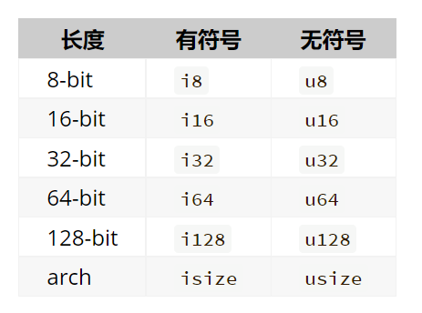

# 第 1 章 基本概念

## 1、变量和常量

```rust
let x = 5; // 声明不可变变量
x = 6; // 此时会报错

let mut y = 5; //声明可变变量
y = 6;

const COUNT = 100;
```

- 变量默认不可变，即值不可更改。常量永远不可变，其无法更换绑定的内容，且无法使用`mut`修饰。这点和 JS 比较相似，但 JS 的可变性是根据数据类型硬性规定的，而 Rust 的自由度更高。
- 重复声明的变量会隐藏之前的变量。

## 2、数据类型

### （1）标量

#### 整型



#### 浮点型

`f32`和`f64`

#### 布尔型

`bool`

#### 字符类型

`char`，大小为 4 字节。

### （2）复合类型

#### 元组

```rust {3}
fn main() {
    let tup: (i32, f64, u8) = (500, 6.4, 1);
    let (x, y, z) = tup;
    println!("The value of y is: {}", y);
    println!(tup.0)
}
```

#### 数组

与元组不同，数组中的每个元素的类型必须相同。Rust 中的数组与一些其他语言中的数组不同，**Rust 中的数组长度是固定的**。

```rust
let a = [1, 2, 3, 4, 5];
let b = [0; 3];	// [0, 0, 0]
```

## 3、函数

```rust {6}
fn main() {
    let x = plus_one(5);
    println!("The value of x is: {}", x);
}

fn plus_one(x: i32) -> i32 {
    x + 1
}
```

## 4、语句

### （1）选择

```rust
fn main() {
    let number = 6;

    if number % 4 == 0 {
        println!("number is divisible by 4");
    } else if number % 3 == 0 {
        println!("number is divisible by 3");
    } else if number % 2 == 0 {
        println!("number is divisible by 2");
    } else {
        println!("number is not divisible by 4, 3, or 2");
    }
}
```

> 不需要小括号括起来表达式，这是吸收了 python 的语法优点。

还能使用`三元运算符`：

```rust
let number = if condition { 5 } else { 6 };
```

> 注意此时每个分支必须是相同的类型。

### （2）循环

#### loop

支持嵌套循环时使用`循环标签`：
```rust {3,13}
fn main() {
    let mut count = 0;
    'counting_up: loop {
        println!("count = {}", count);
        let mut remaining = 10;

        loop {
            println!("remaining = {}", remaining);
            if remaining == 9 {
                break;
            }
            if count == 2 {
                break 'counting_up;
            }
            remaining -= 1;
        }

        count += 1;
    }
    println!("End count = {}", count);
}
```
此时能直接从内层循环直接退出外层循环。

还能让循环返回值：
```rust {8}
fn main() {
    let mut counter = 0;

    let result = loop {
        counter += 1;

        if counter == 10 {
            break counter * 2;
        }
    };

    println!("The result is {}", result);
}
```

#### while

```rust
fn main() {
    let mut number = 3;

    while number != 0 {
        println!("{}!", number);

        number -= 1;
    }

    println!("LIFTOFF!!!");
}
```

#### for

```rust
fn main() {
    let a = [10, 20, 30, 40, 50];

    for element in a {
        println!("the value is: {}", element);
    }
}
```

除此之外我们还能构造`Range`用于遍历：

```rust
fn main() {
    for number in (1..4).rev( {
        println!("{}!", number);
    }
    println!("LIFTOFF!!!");
}
```


