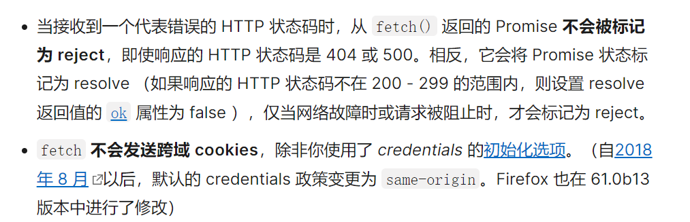

# 第 6 章 网络通信请求

## 1、XMLHttpRequest

```js
var xhr = new XMLHttpRequest();
xhr.onreadystatechange = function () {
  // 通信成功时，状态值为4
  if (xhr.readyState === 4) {
    if (xhr.status === 200) {
      console.log(xhr.responseText);
    } else {
      console.error(xhr.statusText);
    }
  }
};
xhr.onerror = function (e) {
  console.error(xhr.statusText);
};
xhr.open("GET", "/endpoint", true);
xhr.send(null);
```

### （1）属性

- readyState
- onreadystatechange
- response
- responseType
- status
- timeout
- withCredentials
- upload

### （2）方法

- open()
- send()
- setRequestHeader()
- overrideMimeType()
- getResponseHeader()
- getAllResponseHeaders()

## 2、Fetch

```js
// Example POST method implementation:
async function postData(url = "", data = {}) {
  // Default options are marked with *
  const response = await fetch(url, {
    method: "POST", // *GET, POST, PUT, DELETE, etc.
    mode: "cors", // no-cors, *cors, same-origin
    cache: "no-cache", // *default, no-cache, reload, force-cache, only-if-cached
    credentials: "same-origin", // include, *same-origin, omit
    headers: {
      "Content-Type": "application/json",
      // 'Content-Type': 'application/x-www-form-urlencoded',
    },
    redirect: "follow", // manual, *follow, error
    referrerPolicy: "no-referrer", // no-referrer, *no-referrer-when-downgrade, origin, origin-when-cross-origin, same-origin, strict-origin, strict-origin-when-cross-origin, unsafe-url
    body: JSON.stringify(data), // body data type must match "Content-Type" header
  });
  return response.json(); // parses JSON response into native JavaScript objects
}

postData("https://example.com/answer", { answer: 42 }).then((data) => {
  console.log(data); // JSON data parsed by `data.json()` call
});
```

对上面配置的解析：

- referrerPolicy
  - no-referer
  - origin
  - origin-when-cross-origin
  - same-origin
- credential
  - omit：永不发 cookie
  - same-site：跨域时不发
  - include：都尝试发
- mode
  - same-origin：同源请求
  - no-cors：可简单跨域
  - cors：跨域
    与 jquery 的区别：
    

## WebSocket

单个 TCP 连接上进行的全双工通信，解决了 http 无状态、无连接和单向在某些场景下的低效。

```js
let ws = new WebSocket("ws://localhost:8080");
ws.addEventListener("open", (event) => {});
```

除此之外还有`message`、`close`和`error`事件。
