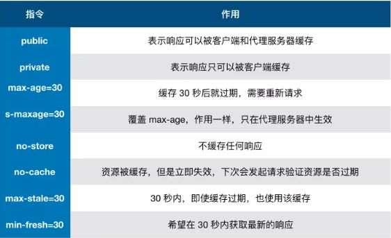

# 第 2 章 HTTP 缓存

## 1、缓存

缓存是一种保存资源副本并在下次请求时直接使用该副本的技术。当 web 缓存发现请求的资源已经被存储，它会拦截请求，返回该资源的拷贝，而不会去源服务器重新下载。缓存需要合理配置，因为并不是所有资源都是永久不变的：重要的是对一个资源的缓存应截止到其下一次发生改变（即不能缓存过期的资源）。

本文将主要介绍**`浏览器`**（私有）与`代理`（共享）缓存，除此之外还有网关缓存、CDN、反向代理缓存和负载均衡器等部署在服务器上的缓存方式，为站点和 web 应用提供更好的稳定性、性能和扩展性。

## 2、浏览器缓存

### (1) 无缓存阶段

首次请求资源无法命中缓存，返回请求的头部字段`Cache-Control`描述了当前资源的缓存策略，具有以下指令：

> `Cache-Control`是`HTTP/1.1`提出的，在此之前使用的是`Expires`，其只给出了资源过期时间，功能较弱。

### (2) 强缓存阶段

如果缓存存在时，如果存在`no-cache`会直接跳过该阶段。之后验证`max-age`是否过期，如果未过期直接使用，过期进入协商缓存阶段。

### (3) 协商缓存阶段

协商缓存是向服务器端验证本地缓存是否还值得使用。

服务器会在响应资源时设置`Last-Modified`或`Etag`首部，前者是资源最后修改时间，后者是资源唯一标识符，后者优先级更高。这两个字段的值会在协商请求时通过`If-Modified-Since`和`If-None-Match`携带，服务器验证比对后，有效返回`304`，并重置`max-age`，失效返回新的资源。
