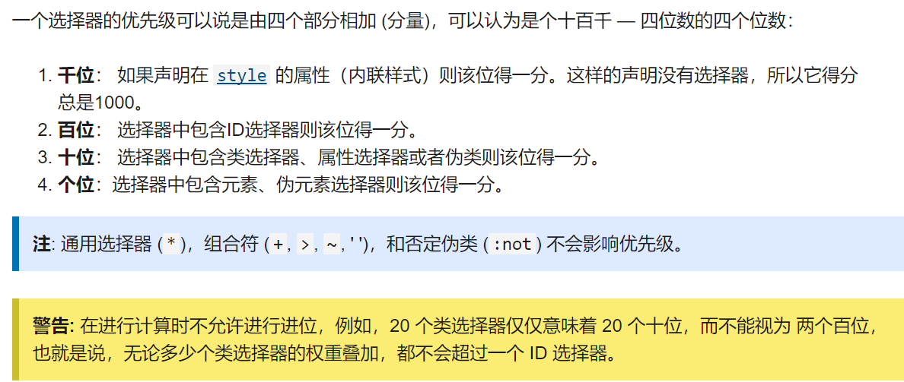

# 第 1 章 选择器

## 1、分类

| 选择器                                                       | 示例                |
| :----------------------------------------------------------- | :------------------ |
| [类型选择器](https://developer.mozilla.org/zh-CN/docs/Web/CSS/Type_selectors) | `h1 { }`            |
| [通配选择器](https://developer.mozilla.org/zh-CN/docs/Web/CSS/Universal_selectors) | `* { }`             |
| [类选择器](https://developer.mozilla.org/zh-CN/docs/Web/CSS/Class_selectors) | `.box { }`          |
| [ID选择器](https://developer.mozilla.org/zh-CN/docs/Web/CSS/ID_selectors) | `#unique { }`       |
| [标签属性选择器 :star:](https://developer.mozilla.org/zh-CN/docs/Web/CSS/Attribute_selectors) | `a[title] { }`      |
| [伪类选择器](https://developer.mozilla.org/zh-CN/docs/Web/CSS/Pseudo-classes) | `p:first-child { }` |
| [伪元素选择器](https://developer.mozilla.org/zh-CN/docs/Web/CSS/Pseudo-elements) | `p::first-line { }` |
| [后代选择器 :star:](https://developer.mozilla.org/zh-CN/docs/Web/CSS/Descendant_combinator) | `article p`         |
| [子代选择器 ](https://developer.mozilla.org/zh-CN/docs/Web/CSS/Child_combinator) | `article > p`       |
| [相邻兄弟选择器](https://developer.mozilla.org/zh-CN/docs/Web/CSS/Adjacent_sibling_combinator) | `h1 + p`            |
| [通用兄弟选择器](https://developer.mozilla.org/zh-CN/docs/Web/CSS/General_sibling_combinator) | `h1 ~ p`            |

> 注意选择器符号间的`空格`，因为没有空格时是双重选择器，例如`p.some`，会选择所有class为some的p标签。`后代选择器`是非常常用的，所以在`less`或者`sass`这种样式构建工具会默认在树形选择关系中自动添加空格，此时可以使用`&`来消除默认的空格。

### 伪类和伪元素

`伪类`用来选择**非严格描述**的子元素（如`:first`）或者在**特定状态时**生效（如：`:active`）。

`伪元素`选择元素的局部，如`::first-line`。

> **`::before`** 创建一个[伪元素](https://developer.mozilla.org/en-US/docs/Web/CSS/Pseudo-elements)，其将成为匹配选中的元素的第一个子元素。常通过 [`content`](https://developer.mozilla.org/zh-CN/docs/Web/CSS/content) 属性来为一个元素添加修饰性的内容。此元素默认为行内元素。

## 2、 选择器优先级

> 简单来说，**越具体的选择样式优先级越高**。
>
> `!important`>`行内`>`id`>`class`、`属性`、`伪类`）>`标签`、`伪元素`

## 7、文本

文本元素是 css 中特殊的存在，它作为内容存在，而不作为盒子存在。

我们可以把文本看做在`block`容器中流动的`inline`元素。

- 换行时默认不打断单词。
- 多个空格当作单个空格处理。
- 换行符无效。要使用` `

## 8、替换元素

[img、input 到底是行内还是块级元素？ - 2350305682 - 博客园 (cnblogs.com)](https://www.cnblogs.com/annie211/p/5933522.html)

又称`行内替换元素`，表现为行内元素，但是具有内在的`width`和`height`属性。譬如`img`、`video`、`iframe`、`input`等。

这里主要讨论`img`。

我们需要图片的大小适应容器的大小，我们可以使用`max-width=100%;`防止图片溢出容器，但是如果图片本身就小于容器呢？回忆之前设置背景图片时使用`background-size: cover/contain;`，图片也有一个功能类似的属性，叫做`object-fit`。

## 9、表格

[样式化表格 - 学习 Web 开发 | MDN (mozilla.org)](https://developer.mozilla.org/zh-CN/docs/Learn/CSS/Building_blocks/Styling_tables)
