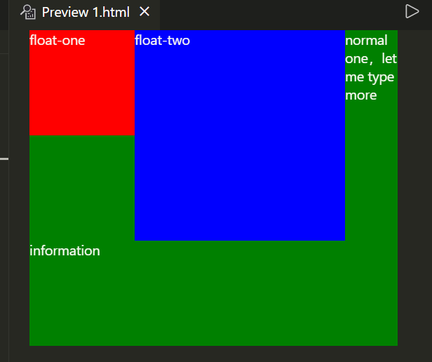
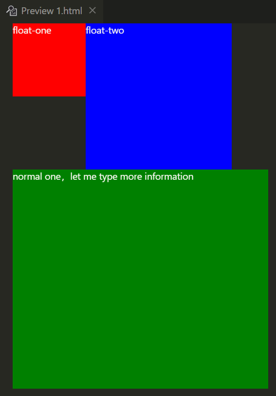
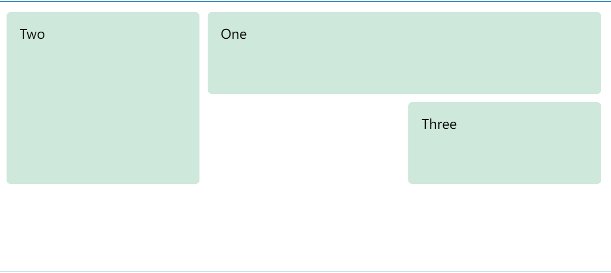
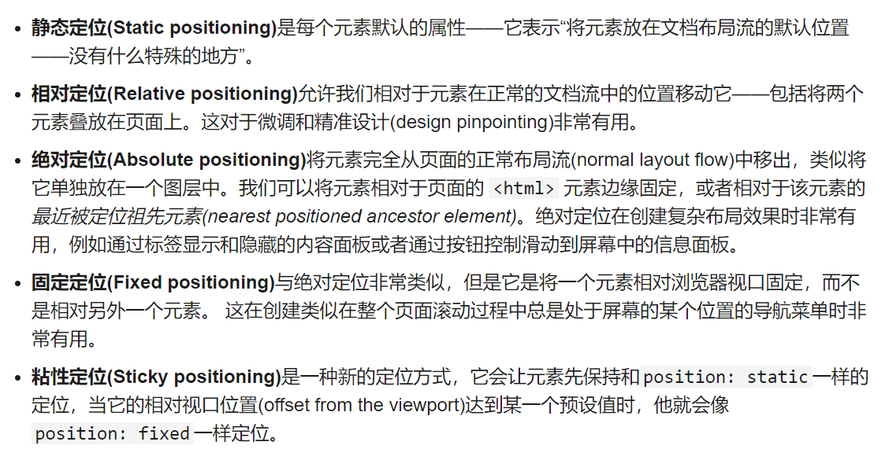
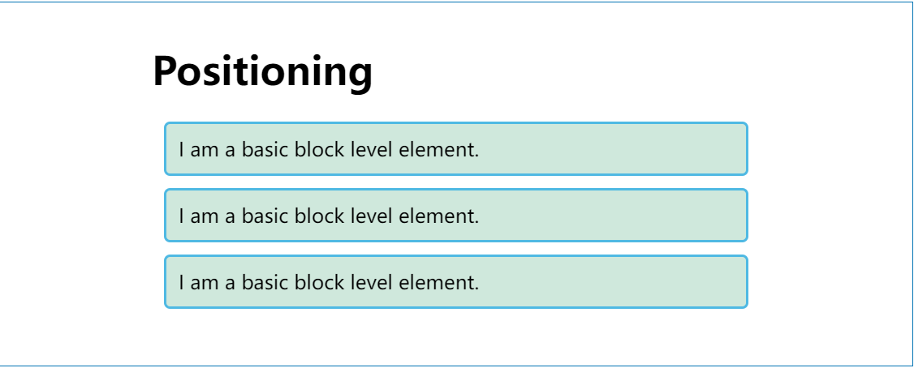
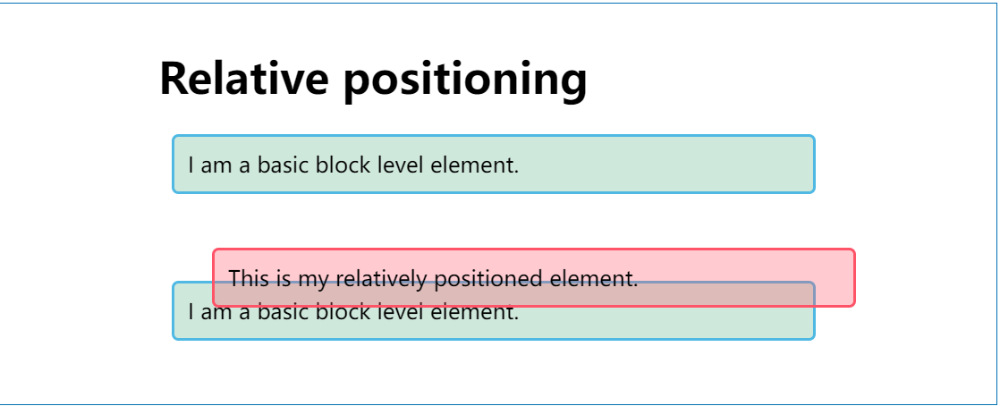
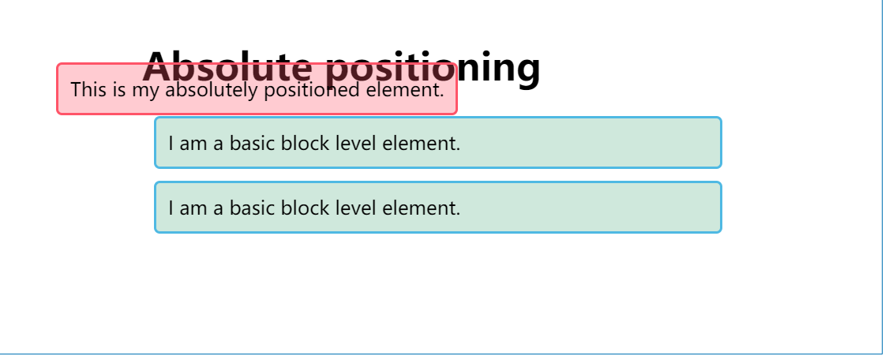
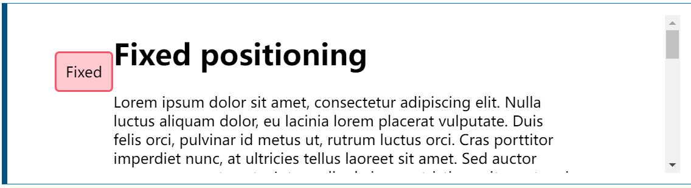
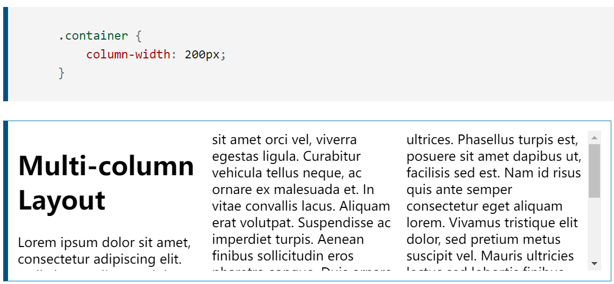

# 第 2 章 布局

## 1、浮动

**float CSS 属性指定一个元素应沿其容器的左侧或右侧放置，允许文本和内联元素环绕它。**

`float: right/left;`

```css
.elem1 {
  height: 100px;
  width: 100px;
  background-color: red;
  float: left;
}
.elem2 {
  height: 200px;
  width: 200px;
  background-color: blue;
  float: left;
}
.elem3 {
  height: 300px;
  width: 350px;
  background-color: green;
  /* clear: left; */
}
```



可见`float`元素间不会冲突，`float`元素和行内元素也不冲突，但会和块级元素冲突。可以使用`clear: left;`清除浮动。结果如下：



## 2、flex 布局 :star:

弹性盒子是一种用于按行或按列布局元素的`一维`布局方法 。

> 可以通过这个小游戏[Flexbox Froggy - A game for learning CSS flexbox](http://flexboxfroggy.com/)学习 flex 的属性。


### （1）flex 容器

`display: flex;`

#### ① flex-direction

主轴的方向，即元素排列方向。

- row（`默认`）
- row-reverse
- column
- column-reverse

#### ② flex-wrap

- nowrap：不分行，挤一挤（`默认`）
- wrap：自动分行
- wrap-reverse：分行，交叉轴方向镜像（尽量不用）

> ① 和 ② 两个属性可以简写为`flex-flow: row wrap;`

#### ③ justify-content

主轴方向上元素的对齐方式和元素间的关系。

- flex-start（`默认`）
- flex-end
- center
- space-between：间隔均匀，首尾无间隔
- space-around：间隔均匀，首尾间隔减半
- space-evenly：间隔均匀，首尾亦如此

> 我们注意到`justify`上没有`items`。

#### ④ align-items

`交叉轴`方向上的对齐方式

- stretch（`默认`）：拉伸占满所有空间
- start：靠上
- end：靠下
- center：靠中间

#### ⑤ align-content

参考`justify-content`，为交叉轴方向上元素间的关系。所以使用该属性的前提是`flex-wrap`属性不能为`nowrap`。

- start（`默认`）
- center
- space-between
- space-around

### （2）flex 元素

#### ① flex

表示元素在`flex容器`中占据的主轴方向的长度。

该属性实际上是`flex-grow`（比例）、`flex-shrink`和`flex-basis`（最小值）组合写法。

#### ② order

元素的相对位置。元素的默认`order`值为 0，值越大越靠后。

#### ③ align-self

元素上该属性的值会覆盖`align-items`上的值。单独对单个元素的对齐方式进行设置。

## 3、grid 布局

指定`列宽`、`行高`、`间隔距离`

比如下面的两行三列：

```css
.wrapper {
  display: grid;
  grid-template-columns: 1fr 1fr 1fr;
  grid-template-rows: 100px 100px;
  grid-gap: 10px;
}
```

对于其中的元素，需要指定占据的行、列的范围

```css
.box1 {
  grid-column: 2 / 4;
  grid-row: 1;
}

.box2 {
  grid-column: 1;
  grid-row: 1 / 3;
}

.box3 {
  grid-row: 2;
  grid-column: 3;
}
```



## 4、定位

> 定位(positioning)并不是一种用来给你做主要页面布局的方式，它更像是让你去管理和微调页面中的一个特殊项的位置。



### （1）static



### （2）relative



> 相对定位并没有脱离原来的文档流，依旧占据着`static`下正常文档流的位置，只是自身展示位置进行了偏移。

### （3）absolute



### （4）fixed



## 5、table 布局

```css
/* 表格 */
form {
  display: table;
  margin: 0 auto;
}

/* 行 */
form div {
  display: table-row;
}

/* label和input分离 */
form label,
form input {
  display: table-cell;
  margin-bottom: 10px;
}

/* 标题 */
form p {
  display: table-caption;
  caption-side: bottom;
}
```

## 6、多列布局

多列布局模组给了我们 一种把`内容`按列排序的方式，要把一个块转变成多列容器(multicol container)，我们可以使用 `column-count`属性来告诉浏览器我们需要多少列，也可以使用[`column-width`来告诉浏览器以至少某个宽度的尽可能多的列来填充容器。


