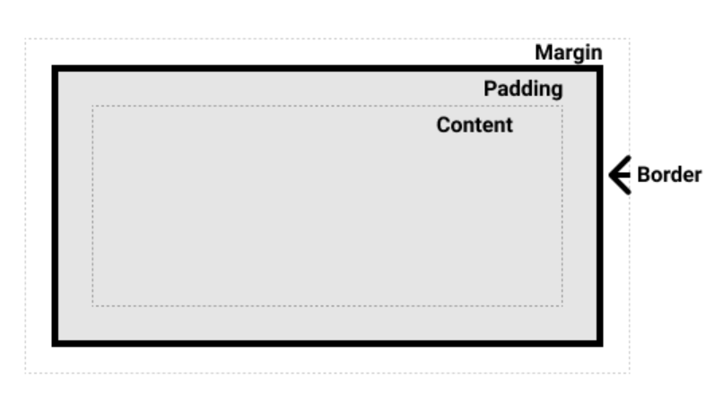

# 盒模型

## 1、分类

### （1）block 元素



默认情况下的盒模型是`box-sizing: content-box;`，即我们设置的`width`和`height`属性是以`content`为标准的。我们常常会想要以`border`为边界设置大小，可以使用`box-sizing: border-box;`。

想要全局设置可以采用如下做法：

```css
html {
  box-sizing: border-box;
}
*,
*::before,
*::after {
  box-sizing: inherit;
}
```

> 如果你有两个外边距相接的元素，这些外边距将合并为一个外边距，即最大的单个外边距的大小。这种现象称为`外边距折叠`。

### （2）inline 元素

盒模型的``内联方向``上的概念适用于`inline`盒子。

可以设置如下属性：

- margin-left/right
- padding-left/right
- border

可见`inline`不能设置`height`和`width`，也不能设置垂直方向上的`padding`和`margin`。

#### （3）inline-block 元素

`inline-block`具有`block`的所有属性，但是它像`inline`一样不会占据整行。当我们想要对一些`span`、`a`标签设置显示背景大小，又不想覆盖其他内容时可以使用。同时也能借此扩大内联元素的显示范围。

## 2、转化

`盒模型`是指 css 中盒子的一系列规范。这些规范主要针对`块级盒子`，部分适用于`内联盒子`（行内盒子）。

盒子类型可以通过`display`属性的`block`和`inline`分别控制。注意此时的分类是指盒子的`对外表现`，`display`同时也能设置容器的`对内表现`，即容器内部元素的布局方式，包括`flex`、`grid`、`box`等。

可见`display`属性具有两种用途，不要混淆。

> 当把`inline`转化为`block`时一般不需要做其他处理。但当`block`转为`inline`时要注意原来`block`中存在其他`block`时的情况。因为内部`block`的对外表现并没有变化，此时外层尽管转化成了`inline`，但效果还是`block`，可以看做被内层元素撑开了。是不是说此时需要给每个内层元素也加上`inline`属性？不需要这么麻烦，我们只需要给外层的容器设置对内`flex`就行了，但因为我们已经用过`display`属性，一旦覆盖之前的就失效了，所有此时我们使用`inline-flex`值来代替。
