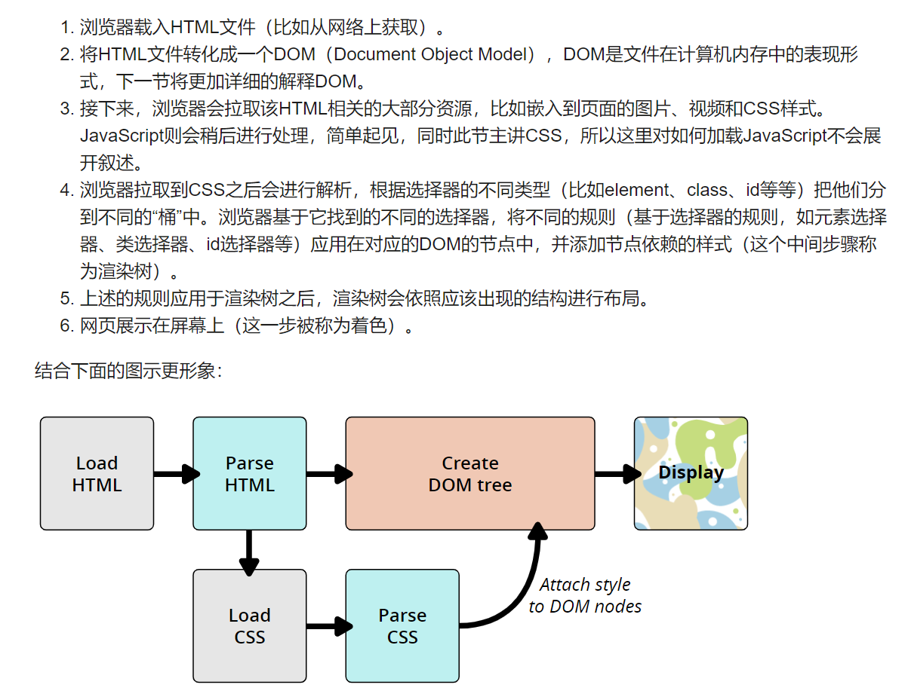
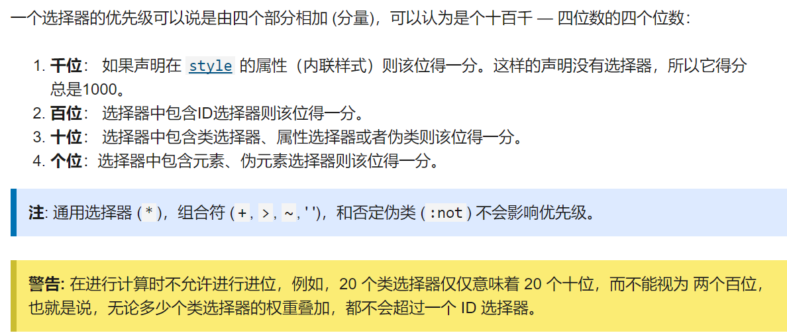
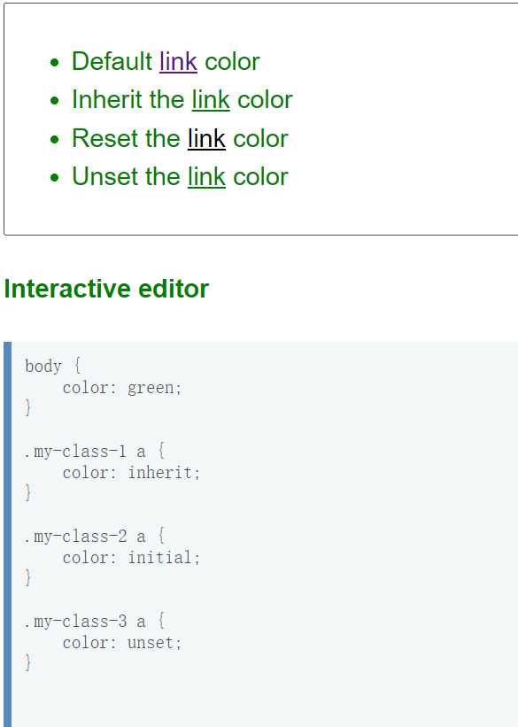
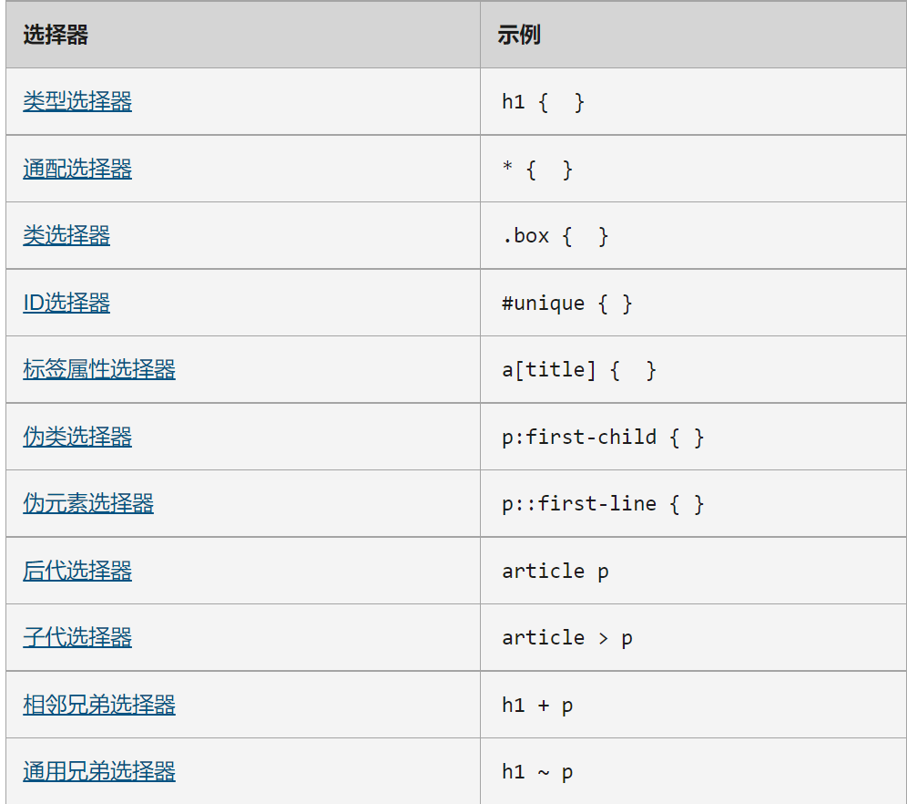
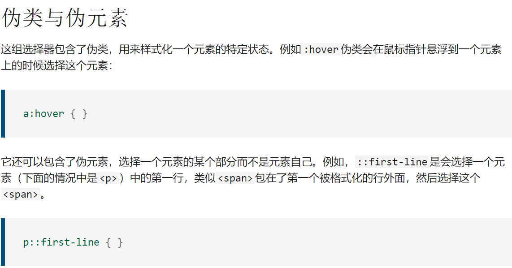
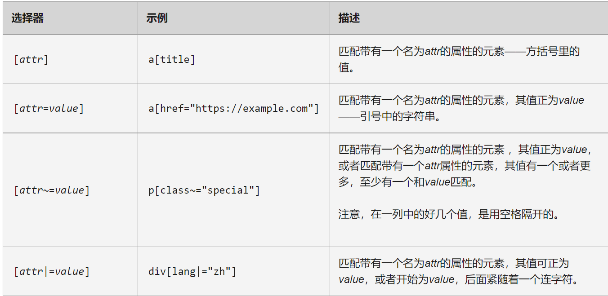
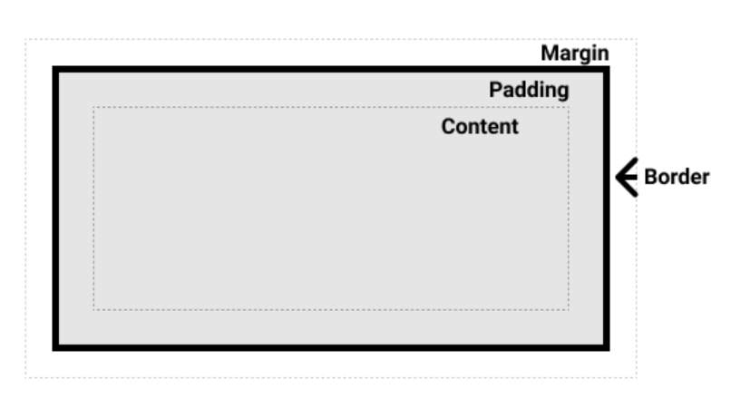

# 第 1 章 基础

## 1、使用 css

### （1）外部引用

```html
<link rel="stylesheet" href="styles.css" />
```

### （2）内部引用

```html
<style>
  h1 {
    color: blue;
    background-color: yellow;
    border: 1px solid black;
  }
</style>
```

### （3）行内引用

```html
<p style="color:red;">This is my first CSS example</p>
```

## 2、css 如何工作



## 3、样式优先级

> 简单来说，**越具体的选择样式优先级越高**。
>
> `!important`>`style属性`>`id选择器`>`类选择器`>`标签选择器`



## 4、继承

继承即**元素的属性值是否继承父级元素的相同属性的值**。

属性是否默认继承可在规范中查到。需要记住默认不继承的几个属性：

- margin
- padding
- border
- background

> 记住`background`默认是不继承的，默认值为`transparent`，所以我们常常有种继承的错觉。

我们可以通过几个关键字手动更改属性的继承性：

- inherit：开启继承，设置为父元素属性值
- initial：关闭继承，设置为默认值
- unset：重置属性，回归初始状态

`unset`可能容易引发混淆，因为上面两个已经足够满足继承性相关要求，该关键字的作用更普遍，用来任何情况下重置属性值。

还有一个`all`属性，相当于引用该元素的所有属性，指定`all: unset;`就可以重置所有属性为初始值。

> 要注意`默认值`和`初始值`的区别，默认值是指一个元素在最原始情况下`html`所规定的默认属性效果，而初始值是在进行某些显式操作之前的效果。

这个十分迷惑：https://developer.mozilla.org/zh-CN/docs/Learn/CSS/Building_blocks/Cascade_and_inheritance



## 5、选择器

### （1）概览

大概分为以下几类：

- 基本选择器
  - 标签选择器
  - 类选择器
  - ID 选择器
- 伪选择器
- 关系选择器



除此之外还有一个`交集选择器`，选择器之间不用空格分隔即可。但不推荐使用。因此我们在写其他选择器时要注意`空格`的使用，以免被当做交集选择器。

```css
.class1.class2 {
  ...;
}
```

### （2）伪类和伪元素

https://developer.mozilla.org/zh-CN/docs/Learn/CSS/Building_blocks/Selectors/Pseudo-classes_and_pseudo-elements

注意`伪类`和`伪元素`的区别：


`伪类`包括`元素伪类`和`状态伪类`，`伪元素`不是真正的元素，只是元素的部分。

### （3）属性选择器



## 6、盒模型

[盒模型 - 学习 Web 开发 | MDN (mozilla.org)](https://developer.mozilla.org/zh-CN/docs/Learn/CSS/Building_blocks/The_box_model)

### （1）block 和 inline

`盒模型`是指 css 中盒子的一系列规范。这些规范主要针对`块级盒子`，部分适用于`内联盒子`（行内盒子）。

盒子类型可以通过`display`属性的`block`和`inline`分别控制。注意此时的分类是指盒子的`对外表现`，`display`同时也能设置容器的`对内表现`，即容器内部元素的布局方式，包括`flex`、`grid`、`box`等。

可见`display`属性具有两种用途，不要混淆。

> 当把`inline`转化为`block`时一般不需要做其他处理。但当`block`转为`inline`时要注意原来`block`中存在其他`block`时的情况。因为内部`block`的对外表现并没有变化，此时外层尽管转化成了`inline`，但效果还是`block`，可以看做被内层元素撑开了。是不是说此时需要给每个内层元素也加上`inline`属性？不需要这么麻烦，我们只需要给外层的容器设置对内`flex`就行了，但因为我们已经用过`display`属性，一旦覆盖之前的就失效了，所有此时我们使用`inline-flex`值来代替。

### （2）盒模型

#### ① block 元素



默认情况下的盒模型是`box-sizing: content-box;`，即我们设置的`width`和`height`属性是以`content`为标准的。我们常常会想要以`border`为边界设置大小，可以使用`box-sizing: border-box;`。

想要全局设置可以采用如下做法：

```css
html {
  box-sizing: border-box;
}
*,
*::before,
*::after {
  box-sizing: inherit;
}
```

#### ② inline 元素

盒模型的部分概念适用于`inline`盒子。

可以设置如下属性：

- margin-left/right
- padding-left/right
- border

可见`inline`不能设置`height`和`width`，也不能设置垂直方向上的`padding`和`margin`。

#### ③ inline-block 元素

`inline-block`具有`block`的所有属性，但是它像`inline`一样不会占据整行。当我们想要对一些`span`、`a`标签设置显示背景大小，又不想覆盖其他内容时可以使用。同时也能借此扩大内联元素的显示范围。

## 7、文本

文本元素是 css 中特殊的存在，它作为内容存在，而不作为盒子存在。

我们可以把文本看做在`block`容器中流动的`inline`元素。

- 换行时默认不打断单词。
- 多个空格当作单个空格处理。
- 换行符无效。要使用`<br>`

## 8、替换元素

[img、input 到底是行内还是块级元素？ - 2350305682 - 博客园 (cnblogs.com)](https://www.cnblogs.com/annie211/p/5933522.html)

又称`行内替换元素`，表现为行内元素，但是具有内在的`width`和`height`属性。譬如`img`、`video`、`iframe`、`input`等。

这里主要讨论`img`。

我们需要图片的大小适应容器的大小，我们可以使用`max-width=100%;`防止图片溢出容器，但是如果图片本身就小于容器呢？回忆之前设置背景图片时使用`background-size: cover/contain;`，图片也有一个功能类似的属性，叫做`object-fit`。

## 9、表格

[样式化表格 - 学习 Web 开发 | MDN (mozilla.org)](https://developer.mozilla.org/zh-CN/docs/Learn/CSS/Building_blocks/Styling_tables)
