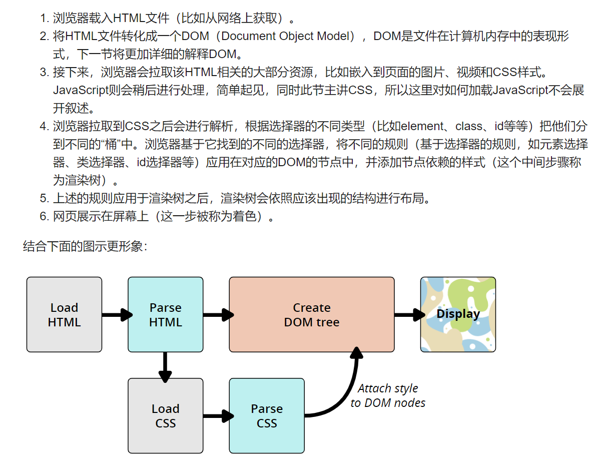

# CSS

## 1、引入 css

### （1）外部引用

```html
<link rel="stylesheet" href="styles.css" />
```

### （2）内部引用

```html
<style>
  h1 {
    color: blue;
    background-color: yellow;
    border: 1px solid black;
  }
</style>
```

### （3）行内引用

```html
<p style="color:red;">This is my first CSS example</p>
```

## 2、css 如何工作


