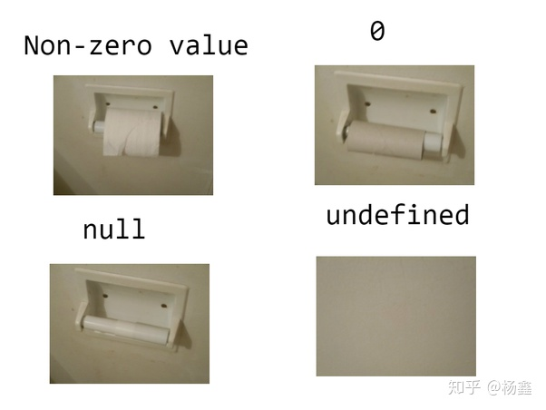

# 第 1 章 基础部分

> 本章节介绍 JS 与其他语言基本通用的内容，主要包括数据类型、表达式及语句等，只作简要描述。

## 一、词法

### 1、字面量

字面量（literal）是直接出现在程序的数值。

### 2、标识符

就是名字。

JavaScript 的标识符必须以字母、下划线或美元符号开头。

### 3、保留字

包括关键字的所有不允许使用的标识符。某些关键字在某些环境下允许作为标识符使用，如可以用作对象的属性名，但尽量不这样用。

### 4、Unicode

JavaScript 使用 Unicode 作为字符集，但考虑到可移植性等原因，标识符建议只使用 ASCII 字符。

## 二、数据类型

### 1、概览

#### （1）分类

JavaScript 类型可以分为两类，`原始类型`和`对象类型`。普通对象可以看做是属性的集合。

对象类型是可修改的（mutation），原始类型是不可修改的（immutable）。

> 就这点而言，JS 和 python 比较相似。

- **原始类型**
  - number
  - string
  - boolean
  - Symbol 型
  - null
  - undefined
- **对象类型**
  - array
  - Map
  - Set
  - RegExp
  - Date
  - Error
  - ....
  - **函数**
  - **类**

#### （2）差别

可变与否只是分类数据类型的基本标准，在底层上它们有更显著的差异：

对于原始类型，只要它们字面量相同，它们就是相等的，即可以被`===`判真。

而对于对象类型，不同的对象永不相等（相同对象自然相等），也可以认为是因为对象没有字面量，就算两个对象的所有属性都相同，它们依然有些看不见的东西并不相同。

那就是如何判断两个对象`看起来相等`呢（即具有相同的属性）？此时我们就需要枚举每一个属性进行比较来判断。值得注意的是当属性值是对象时我们还需要递归地去比较这个对象属性的子属性，确保每个`端属性`都被枚举到。

> 想要复制出一个看起来相等的数组对象可以使用`Array.from()`函数，注意是浅拷贝，js 里根本原生提供深拷贝。可以使用`lodash`库的[_.cloneDeep()]([Lodash Documentation](https://lodash.com/docs/4.17.15#cloneDeep))方法。

#### （3）测试

- typeof

  `typeof v === 'type'`

  值得注意的是函数的类型为`function`，数组的类型为`object`。

- instanceof

  `v instanceof Array`

  判断`v`的原型是不是`Array.prototype`。

- Constructor.prototype.toString()

### 2、数值

#### （1）字面量

```js
0;
0xff; // 255
0b10101; // 21
0o377; // 255
3.14;
0.3333; // 0.333
6.02e-23;
```

#### （2）常用运算

- **Math 类**
  - pow()
  - round()
  - random()
- Number 类
  - parseInt()
  - parseFloat()
  - isNaN()

> 数值的`toString()`方法值得注意，默认无论什么进制，都会转化为十进制字符串，如果想要保持原来的格式需要使用`toString(N)`。

### 3、字符串

JavaScript 使用 Unicode 字符集的 UTF-16 编码，以 2 个字节作为基本字单元，任何字符是基本字单元的整数倍（大部分为单个基本字单元大小）。字符串的 length 方法是基本字段元的长度。使用`for/of`循环或`...`操作符迭代字符串时以单个字符为单元。

> 字符串的所有方法都不会本地操作。

#### charCodeAt()

charCodeAt() 方法返回 0 到 65535 之间的整数，表示给定索引处的 UTF-16 代码单元。
可用于表示字符间的`距离`。

#### concat()

#### endsWith()

判断当前字符串是否是以另外一个给定的子字符串“结尾”的。

#### includes()

str.includes(searchString[, position])
只判断有没有。

#### indexOf()

匹配不成功返回 -1 ，同理还有`lastIndexOf

#### substring()

`substring(start, end)`

#### slice()

第一个参数是子字符串的开始位置，第二个参数是子字符串的结束位置（不含该位置）。可为负数

#### split()

#### replace()

**`replace()`** 方法返回一个由替换值（`replacement`）替换部分或所有的模式（`pattern`）匹配项后的符串。模式可以是一个**字符串**或者一个**正则表达式**，替换值可以是一个字符串或者一个每次匹配都要调**回调函数\*\***如果`pattern`是字符串，则仅替换第一个匹配项。\*\*所以常用正则表达式使用全局匹配``jslet a = "first second third";console.log(a.replace(" ", "%20")); // "first%20second third"console.log(a.repalce(/ /g, "%20")); // "first%20second%20third"`

同样支持正则表达式的还有`match`和`search

#### trim()

去除字符串两端的空格

#### localeCompare()

字典序比较大小，直接用运算符比较也一样。

#### padStart()

参数为填充后长度和填充字符串，默认空格填充。

#### padEnd()

#### repeat()

将当前字符串重复`n`次，用于快速生成字符串。

> 模板字符串

```js
let a = 1;
let b = 2;
let result = `sum of them is ${a + b}`; // 3
```

> 大括号内容作为 js 表达式解释。

### 4、null 和 undefined



用 null 表示程序级别、正常或意料之中的没有值；用 undefined 表示一种系统级别、意料之外或类似错误的没有值。

> 通常情况我会主动使用 null 而从不使用 undefined。

### 5、符号

符号类似于一种没有字面量的字符串，它最主要的特点是每次通过`Symbol(string)`生成的符号都是独一无二的。因为`string`只是当前符号的`描述`，可以通过`description`属性来获取。

#### 作为属性名

```js
let symbol = Symbol();
let a = {
  [symbol]: "hello",
};
a[symbol]; // 'hello'
```

Symbol 作为属性名，遍历对象的时候，该属性不会出现在`for...in`、`for...of`循环中，也不会被`Object.keys()`、`Object.getOwnPropertyNames()`、`JSON.stringify()`返回。但是，它也不是私有属性，有一个`Object.getOwnPropertySymbols()`方法，可以获取指定对象的所有 Symbol 属性名。该方法返回一个数组，成员是当前对象的所有用作属性名的 Symbol 值。

#### 获取相同符号

可以通过对`Symbol.for()`传入相同字符串时返回相同值的符号（无则新建，有则使用）。

#### 内置 Symbol 值

##### Symbol.iterator

返回该对象的默认遍历器。

### 6、全局对象

> 关于对象的内容在后续章节介绍，这里仅介绍全局对象。

全局对象是 js 工作的场景下的一个上帝对象，全局对象的属性是一系列全局定义的`常量`（undefined 等）、`函数`（eval() 等）和`对象`（Math）。

因为全局对象的属性是全局定义的，所以可以像全局变量一样使用这些属性，而无需像`对象.属性`的形式来使用。全局对象通过一个引用自身的属性来访问自己，在浏览器环境中是`window`，在 Node 环境中是`global`，在想要操作全局对象本身时可以这些属性来代替。

> ES2020 定义了`globalThis`属性以在任何环境下引用全局对象。

## 三、变量和常量

变量容易理解，何为常量？**把一个值永久地赋给一个名字，这个名字就是常量。**

常量是指**名字和值映射关系的一种绑定关系**，值的可变与否并不因此制约，那是值所属的数据类型所决定的。

### let

我们使用`let`声明变量，具有块级作用域，和其他高级语言的变量行为基本完全一致。

### const

使用`const`声明常量，常量在声明时必须初始化，也是块级作用域。

> 块级作用域指`{}`包含的代码块（包括在某些时候大括号本身省略时），显然函数作用域也属于块级作用域。

### var

在 ES6 之前，js 只能用 var 声明变量，var 具有一些奇怪的特性，现在尽量避免使用 var，但了解这些特性是必要的。

- var 只有函数作用域，没有块级作用域。一切函数体之外的 var 变量都是全局变量。
- 通过 var 声明的全局变量作为全局对象的属性存在，这点与 const 和 let 不同。但是该属性不能通过`delete`操作符删除。
- 在同一作用域下使用 var**多次声明**同名变量是合法的，前面的会被覆盖。
- var 声明的变量会被**提升到作用域最前面**（hoisting），故可以在声明之前引用 var 变量，此时引用的值为 undefined（let 下这种情况会报错），因为**var 变量的初始化还是在其定义的位置**。显然这个特性并不会有实际的使用价值，且常常引发错误。

> 在非严格模式下，可以给从未声明的变量赋值，此时会创建一个全局变量。该全局变量作为全局对象的属性存在，但可以被 delete 操作删除。

## 四、其他

> JavaScript 是类 c 语言。语句上几乎完全继承了 c 的语法，暂且不再赘述。只讲述个别特性。

### 1、关于遍历

#### for/of

`for/of`循环只能作用于`可迭代对象`，例如数组、字符串和集合等，注意一般对象不是可迭代对象。

```js
let m = new Map([["key", "value"]]);
for (let [k, v] of m) {
  k; // "key"
  v; // "value"
}
```

本例用到了`Map()`和`解构赋值`，在后面会具体介绍。

> 其中 Map 的构造函数有些奇怪，只接受可迭代对象（拒绝了 js 最基本的对象字典）
>
> https://developer.mozilla.org/zh-CN/docs/Web/JavaScript/Reference/Global_Objects/Map/Map

> 数组的迭代是`实时`的，迭代时的操作会反馈到之后的迭代过程。

#### for/in

`for/in`可以枚举任何对象，但只能枚举对象的`可枚举属性`（在对象章节有介绍），且会枚举继承的可枚举属性，这可能不是我们真正想要的，我们可能只想遍历自己显示添加上的那些属性，于是可以使用`Object`对象的一些方法结合`for/of`来枚举一般对象的属性。

- **Object.keys()**

  返回对象`属性名`的数组，于是再使用`for/of`来遍历。

  ```js
  for(let k of o.keys()){
      o.k	...
  }
  ```

- **Object.values()**

  返回对象`属性值`的数组。

- **Object.entries()**

  返回键值对数组的数组，需要使用二元数组来解构赋值。

> 当枚举的的对象是数组时，使用`for/in`遍历出的内容为数组的`索引值`，而不是内容，所以遍历数组时最好使用`for/of`。

### 2、关于严格模式

严格模式指在脚本或函数体的开头使用`"use strict"`指令，以对语句提供更强的错误检查，修复了部分语言缺陷。某些编程环境下会默认开启严格模式。

严格模式的要求很多，但在大部分在基础开发都不会涉及或者本身已经成为了一种默认的规范，在这里只介绍常见的几条规则。

- 不允许使用`with`语句。实际上 with 语句在非严格模式下也几乎废弃。
- 变量在使用前必须声明。之前提到给未声明的变量赋值是允许的，相当于全局变量，这在严格模式下是禁止的。
- 函数作为函数（而非方法）调用时，`this`的指向为`undefined`，而不是全局对象。关于 this 指向是后面的重点。
