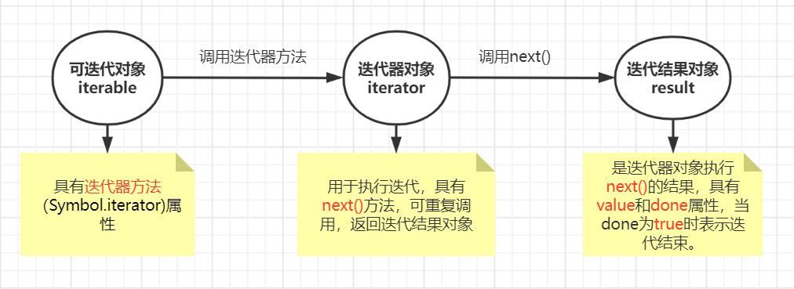

第8章 迭代器

## 1、迭代器

### （1）可迭代对象的使用

可迭代对象有如下用途：

- `for of` 遍历
- `...`操作符展开为数组
- 对可迭代对象解构赋值

### （2）迭代原理



`迭代结果对象`的`value`属性常常是我们真正需要的数据，前面提到的各种对可迭代对象的访问方式都隐式地执行了上面的流程。

值得注意的是，`迭代器对象`本身也是`可迭代对象`，具有`Symbol.iterator`属性，返回该迭代器对象本身。

如下：

```js
let list = [1,2,3,4];
let iter = list[Symbol.iterator]();
let head = iter.next().value;	// 1
let tail = [...iter];	// [2,3,4]
```

### （3）实现可迭代对象类

> 当拿一个可迭代对象对执行迭代相关操作时，会自动通过它的`Symbol.iterator`方法获取到`迭代器对象`，通过`next`函数获取当前的状态，并递归的使用该迭代器对象（本质上也是可迭代对象）的`Symbol.iterator`方法获取下一个状态的迭代器对象。

实现可迭代Range类：

```js
class Range {
    constructor (from, to){
        this.from = from;
        this.to = to;
    }
    [Symbol.iterator](){
        let next = Math.ceil(this.from); 	// 起始值
        let last = this.to;		// 最大值
        return {
            next(){
                return (next<=last)? { value: next++ }: { done: true };
            },
            [Symbol.iterator]() { return this };
        }
    }
}
```

通过迭代器我们可以重写一些迭代方法。如map()：

```js
fucntion map(iterable, f){
    let iterator = iterable[Symbol.iterator]();
    return {
        [Symbol.iterator](){ return this },
        next(){
            let v = iterator.next();
            if(v.done)
                return v;
            else
                return { value: f(v.value) };       }
    }
}

[...map(new Range(1,4), x=>x*x)];	// [1,4,9,16]
```

> 非常巧妙。

