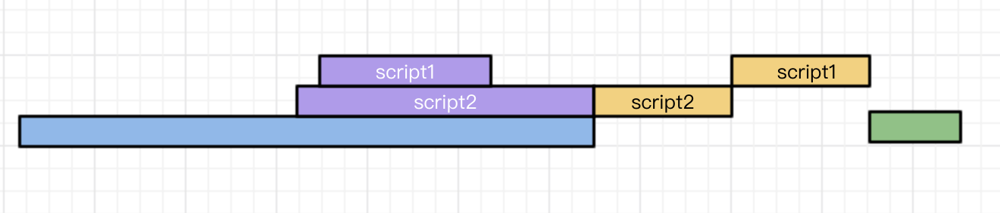

# 第6章 模块

## 1、概述

模块化的目的是能够用不同作者和来源的代码模块化组装成大型程序，而不会产生命名冲突。由于打包工具的支持，**基于闭包的模块化在实践中称为最常用的模块化形式**，核心是沿用了Node的`require()`函数。事实上ES6已经使用`import`和`export`关键字定义了自己的模块化格式，但在实践中还是要依赖打包工具。

ES6和Node模块区别：


## 2、基于闭包的模块化原理

之前已经详细讲过闭包的原理，它是因为词法作用域存在而产生的，函数内使用的变量依赖于其定义时的环境，这常常会产生了一些意想不到的困惑，但我们也能利用这个“缺点”做些有意义的事情，即我们可以通过函数暴露的一些接口（通过`return`），去获取到想要的环境状态，而隐蔽不想要暴露的状态，这不正是我们使用模块化想要达到的效果吗？

先来看看闭包如何实现模块化：

```js
const stats = (function() {
    // 需要隐藏的函数
    const sum = (x, y) => x+y;
    const square = x => x*x;
    // 需要暴露的函数
    function mean(data){
        return data.reduce(sum)/data.length;
    }
    function stddev(data){...}
    // 返回函数构成的对象
    return { mean, stddev } ;
})()

// 其他js使用时
stats.mean(...);
stats.stddev(...);
```

这就通过闭包实现了简单的模块化了，我们可以访问到暴露的函数而不会破坏内部的实现。同时我们暴露的函数依赖于`stats`而存在，在`html`中引入多个`script`时就不会产生命名冲突了。

但目前的实现总体还不够优雅，因为我很难直到当前都有哪些模块可以用，于是我们又引入一个叫`modules`的全局对象用来管理所有模块和一个叫`require`的函数用来访问其他模块。同时为了防止模块对象间的名字会重复，我们通过模块地址来标识模块。

实现：

```js
const modules = {};
function require(moduleName) { return modules[moduleName];}

modules["stats.js"] = (function(){...})();
modules["other.js"] = (function(){...})();

// 引用模块
const stats = require("stats.js")
const other = require("other.js")
...
```

可见我们把模块作为属性集中在一个顶级模块`modules`里，再通过顶级模块的`require`函数实现模块名到模块内容的映射访问。

> 我们已经完全实现了一种js的模块化，只是还不够优雅，譬如我们要显示地把模块注册到`modules`中，同时模块内也要写成`立即执行函数`的形式并把暴露的内容通过return返回。而官方的模块化实现隐蔽了这些丑陋的操作，使使用模块化编程使用起来更加优美、自然，也更强大，但我们还是应该清楚模块化实现的本质。

## 3、Node的模块

### （1）导出

Node有一个全局的`exports`对象，通过把导出的内容添加到该对象的属性即可。

```js
const sum = (x, y) => x+y;
exports.sum = sum;
```

事实上，该`exports`对象是如下方式产生的：

```js
var exports = modules.exports;
```

真正的全局对象是`modules`，负责模块的一系列功能，`export`只是简化了书写。

我们常常只想让模块导出一个函数或类，这时候可以这样写：

```js
modules.exports = class BitSet {...}
```

> 注意此时不能用`exports`，不然只是把`exports`标识符绑定到其他对象上，而达不到导出的效果。

### （2）导入

```js
// 导入系统模块
const fs = require("fs")

// 导入自定义模块
const stats = require("./stats.js")
```

上面的导入方式都是把模块暴露的内容以对象的形式全部导入，也可使用解构赋值有选择地导入：

```js
const { main } = require("./stats.js")
```

## 4、ES6的模块

模块化脚本和常规脚本具有根本区别，常规脚本中，顶级声明的变量、函数和类会进入被所有脚本共享的全局上下文。ES模块化的代码自动应用严格模式，不需要写`use strict`，在模块中，即使在顶级代码中的`this`也是`undefined`。

> 打包工具负责把独立的JavaScript代码模块组合成一个大型非模块化的包。

### （1）导出

#### ① 逐个导出

```js
export const PI = Math.PI;
export function degree(){...}
```

#### ② 打包导出

```js
export { PI, degree as D }
```

#### ③ 默认导出

```js
export default { name: "yeumeng" }
```

> 默认导出在导入是比较方便，在只导出单项内容时优先使用。与`export`语法不同，`export default`后面的花括号是被导出的对象字面量。

### （2）导入

#### ① 具名导入

```js
import { PI, degree } from './stats.js'

// 导入重命名
import { degree as D} from './stats.js'
```

> 这种方式需要事先知道导出的名称。
>
> 注意必须写不能省略的路径名。

#### ② 默认导入

```js
import info from '../stats.js'
```

> 导入`export default`导出的内容，名字可任意指定。

#### ③ 完全导入

```js
import * as stats from "./stats.js"
```

> 把`export`导出的全部内容作为对象的属性导出。

#### ④ 运行导入

因为模块中的代码在首次导入时会运行一次，我们可以借以导入操作运行模块。

```js
import "./run."
```

## 5、import() 动态引入模块

静态模块导入需要先加载所有模块再执行，导致首屏加载常常比较慢，而有些模块常常是我们目前用不到的，可以通过`import()`动态导入替换。即当我们真正用到一些模块的功能时再去导入。

静态导入：

```js
import * as stats from "./stats.js"
```

动态导入：

```js
import("./stats.js").then(stats => {
    let average = stats.mean(data);
})	// 返回期约对象
```

> 通过有意识地使用动态`import()`调用，可以把大文件拆分为多个小文件，实现按需加载。

## 6、在网页中使用模块

> 首先要清楚浏览器的如下特性：
>
> - 脚本的执行和dom的渲染无法只能有一个在进行，js脚本也只能有一个在执行，浏览器的内核是单线程的。
> - 下载文件不占据主线程，可以同步进行。

目前的线上部署还是在很大程度上依赖于打包（性能要求，以及复杂程度），但在开发状态可以使用原生的模块支持。

该标签用于标记一个模块化程序的起点，是静态引入的：

```html
<script type="module">import "./main.js"</script>
```

带有`type="module"`的脚本会像带有`defer`属性的脚本一样被推迟到HTML解析完成后执行。

> :bell: 在网页中使用模块会默认加入跨域请求的限制，在引入了安全性的同时也带来了一些不便，即开发时无法使用`file:URL`来测试模块，而需要使用静态服务器的支持。

## 7、浏览器如何加载页面

[浅谈script标签中的async和defer](https://www.cnblogs.com/jiasm/p/7683930.html)

#### ① 普通script


文档解析的过程中，如果遇到`script`脚本，就会停止页面的解析进行下载，所有资源下载完毕后，按顺序依次执行。当这两个脚本都执行完毕后，往下继续解析页面。

#### ② defer

> 推迟执行。



文档解析时，遇到设置了`defer`的脚本，就会在后台进行下载，但是并不会阻止文档的渲染，当页面解析和渲染完毕后。会等到所有的`defer`脚本加载完毕并按照顺序执行，执行完毕后会触发`DOMContentLoaded`事件。

#### ③ async

> 赶紧下载，赶紧执行。


`async`脚本会在加载完毕后立即执行。`async`脚本的加载不计入`DOMContentLoaded`事件统计，故下图也可能发生：


> `defer`和`async`可以看做对浏览加载页面的两种不同角度的优化。两者都能加速js文件的下载，`defer`基于安全性的考量推迟了脚本的执行，`async`基于性能的考量加速了脚本的执行。

