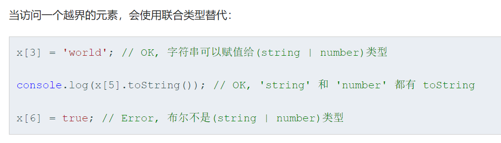

# 第 1 章 数据类型

包括与JS表现一致的基本数据类型`boolean`、`number`、`string`、`null`、`undefined`和`symbol`。

复合数据类型`array`、`tuple`、`enum`、`any`、`void`、`never`和`object`。

定义声明变量使用以下格式：

```tsx
let obj: type = something;
```

## 1、array

`TYPE[]`或者`Array<TYPE>`

```tsx
let list: number[] = [1, 2, 3];
let list: Array<number> = [1, 2, 3];
```

> 这个数组比普通 js 要严格，要求数组元素类型相同。除非使用`Array[any]`。

## 2、tuple

```ts
// Declare a tuple type
let x: [string, number];
// Initialize it
x = ['hello', 10]; // OK
// Initialize it incorrectly
x = [10, 'hello']; // Error
```



## 3、enum

注意枚举是个类型，而不是一种值，在行为上类似一个对象上的映射操作。

```ts
enum Color {Red, Green, Blue}
let c: Color = Color.Red
console.log(c, typeof c)	// 0, number
console.log(Color[c])	// Red
```

## 4、any 、void和never

我们会想要为那些在编程阶段还不清楚类型的变量指定一个类型，算是与js`兼容`的一种方案。

> 注意这和声明时不指定类型是有区别的，不指定时会得到推理的类型，类型照样是固定的。

和`any`相反的有一个`void`类型，代表没有类型，一般只用作修饰没有返回值的函数：

```tsx
function warnUser(): void {
    console.log("This is my warning message");
}
```

还有一个`never`类型，它代表一种永远无法抵达的状态，是所有其他类型的子类型，一般不会用到。

## 5、null 和 undefined

这两个类型都只有一个值，就是他们本身。

这两个类型是其他所有类型的`子类型`，即如下操作是合法的：

```ts
let n: number = 1
number = null
```

当你指定了`--strictNullChecks`标记，`null`和`undefined`只能赋值给`void`和它们各自。 这能避免 *很多*常见的问题。

> 一般建议开启这个标记。当真正需要使用这两个值赋值到其他类型时可以使用联合类型。

## 6、类型断言

`any`在某种程度上临时关闭了类型检查的特性，如果你确定发生了什么，可以手动开启：

```ts
// 方式1
let someValue: any = "this is a string";
let strLength: number = (<string>someValue).length;

// 方式2
let someValue: any = "this is a string";
let strLength: number = (someValue as string).length;
```

> 在`JSX`中只能使用第二种方式。

