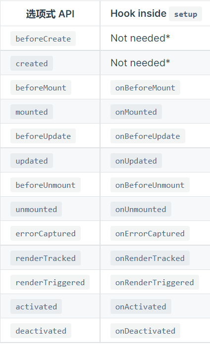
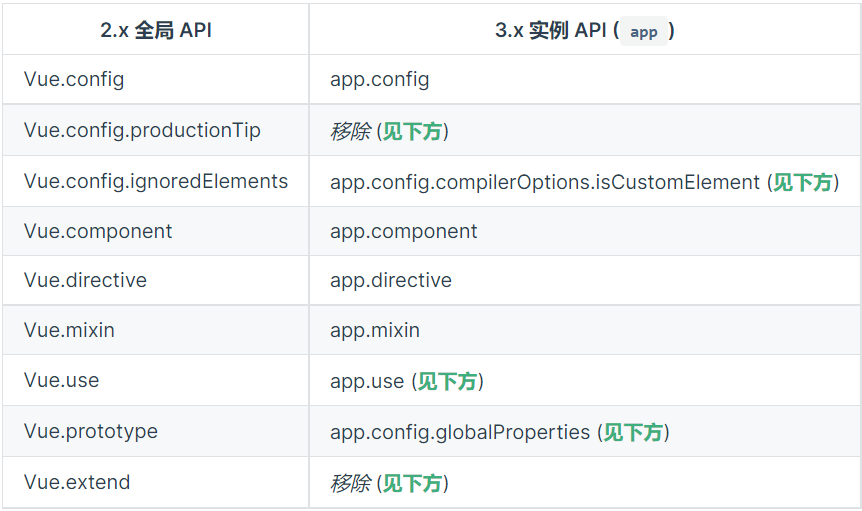

# 第 8 章 vue3

## 1、概览

### (1) 优化

速度更快：

- 重写了虚拟 dom 的实现
- 模板编译优化
- 更高效的组件初始化
- update 性能提升
- SSR 速度提升

打包更小：

- 使用 webpack 的 tree-shaking

更易维护：

- options API
- 逻辑组合与复用
- 配合其他框架
- 更好的 ts 支持

开放更多底层功能：

- 自定义渲染 API
- 暴露响应式 API

### (2) 新特性

- framents：支持多根节点
- teleport：组件任意门
- createRenderer：构建自定义渲染器
- composition：逻辑组合、复用和管理

### (3) 非兼容更改

### (4) 移除

- `$on`、`$once`和`$off`实例方法
- 过滤器
- `$destroy`

## 2、组合式 API

### (1) 为什么需要

vue2 是以组件为代码组织划分的最小单元，同一组件下的相同类别的功能如`data`、`method`被统一管理，本质上是采用声明式的。但事实上就是在一个组件内部也是可以划分出若干个逻辑功能点，每个功能点可能同时依赖着`data`、`method` 和`watch`等，有时候按照功能点来组织代码会更容易复用和维护。组合式 API 就是为了解决这个问题。
组件通过调用功能点来组织代码，减小了耦合度。所有调用操作被写在组件的`setup(props)`选项中，该函数的返回值被绑定到组件实例上调用。

> `setup`的执行实际发生在`props`获取后，组件实例创建之前，所以不要在 setup 中调用组件实例。

### (2) 响应式

#### ① 构建响应式

第一个要考虑的问题恐怕就是怎么构造响应式状态并向组件传递。
首先是构建一个响应式的对象：

```js
// 响应式状态
const state = reactive({
  count: 0,
});
```

此时导出的`state`就会被挂载到`data`中。
如果不是对象呢，只需要一个基本类型的值的时候：

```js
const count = ref(0);
```

此时`count`会被封装为一个响应式对象，具有唯一的`value`属性，所以在访问和修改时不要忘记操作`value`。这样感觉有点麻烦，所有在从`setup`中导出时会对响应式值自动解包，在组件中使用时无需使用`value`。
除非`ref`作为深层属性时，此时无法自动解包，但作为响应式对象的属性时也会自动解包。

> `ref`也是可以构造对象的响应式的，也是通过 value 访问，但似乎没有这样使用的必要。

在使用 ES6 对响应式对象解构时将会消除响应式：

```js
setup(props) {
  const { title } = props // title 不再具有响应式
}
```

此时可以使用`toRefs(props)`，它会对解构后的对象添加响应式。
如果只是访问响应式对象的属性作为新的状态呢？如果该属性是对象不需要做任何处理，但如果是基本类型时：

```js
setup(props) {
  const title = toRef(props, 'title')
}
```

:::tip 提醒
永远记得：真正的`响应式`描述的是视图和状态的关系，状态和状态之间事实上没有啥响应式一说，那叫做`引用`，在内存中共享一块堆空间，对于一个经过`reactive`或`ref`处理过的数据自然会变成对象，但响应式对象并不需要给它的值属性也设置为响应呀，因为已经足够监听到对它的操作了。
为什么在`method`中定义的方法可以直接通过`this.state`直接赋值修改基本类型的状态，而在`setup`中却需要`state.value`呢？因为前者能监听到，后者监听不到了，不管对任何东西做赋值，只要是通过`对象.属性`的都能够被监听到，直接赋值肯定没办法监听。
:::
除此之外 vue3 还提供了一个`readonly()`函数，该函数依然返回响应式对象的引用，但是只读的。

#### ② 原理

通过`ref()`构建的响应式依然使用`Object.defineProperty()`，但是`reactive()`时是使用 ES6 的`Proxy`实现拦截，并在操作时使用`Reflect`。

### (3) setup

setup 可以接收两个参数`props`和`context`，也可以直接返回一个渲染函数：

```js
export default {
  setup(props, { expose }) {
    const count = ref(0);
    const increment = () => ++count.value;

    expose({
      increment,
    });

    return () => h("div", count.value);
  },
};
```

除此之外这里还向父组件暴露了`increment`方法，可以通过`ref`调用。

### (4) 生命周期钩子

setup 中也能调用声明周期钩子：

> 因为 setup 是围绕 beforeCreate 和 created 生命周期钩子运行的，所以不需要显式地定义它们。换句话说，在这些钩子中编写的任何代码都应该直接在 setup 函数中编写。



### (5) provide 和 inject

在 vue2 中，我们并不常用`provide`和`inject`进行组件通信，因为他们不是响应式的，这在 vue3 中被完美解决了。

父组件使用`provide`，并提供修改方法：

```js
export default {
  components: {
    MyMarker,
  },
  setup() {
    const location = ref("North Pole");
    const geolocation = reactive({
      longitude: 90,
      latitude: 135,
    });

    const updateLocation = () => {
      location.value = "South Pole";
    };

    provide("location", readonly(location));
    provide("geolocation", readonly(geolocation));
    provide("updateLocation", updateLocation);
  },
};
```

子组件注入，有个设置默认值的可选参数：

```js
export default {
  setup() {
    const userLocation = inject("location", "The Universe");
    const userGeolocation = inject("geolocation");
    const updateUserLocation = inject("updateLocation");

    return {
      userLocation,
      userGeolocation,
      updateUserLocation,
    };
  },
};
```

### (6) 响应式计算和侦听

#### ① computed

`computed`也能调试`get`和`set`了：

```js
const plusOne = computed(() => count.value + 1, {
  onTrack(e) {
    // 当 count.value 作为依赖被追踪时触发
    debugger;
  },
  onTrigger(e) {
    // 当 count.value 被修改时触发
    debugger;
  },
});
```

#### ② watchEffect

侦听函数体依赖变化并调用函数：

```js
watchEffect(() => console.log(count.value));
```

组件卸载时自动停止，也可以手动停止：

```js
const stop = watchEffect(() => {
  /* ... */
});

// later
stop();
```

同时 watchEffect 还能执行清除工作，在下次回调开始前或停止操作时执行：

```js
watchEffect((onInvalidate) => {
  const token = performAsyncOperation(id.value);
  onInvalidate(() => {
    // id has changed or watcher is stopped.
    // invalidate previously pending async operation
    token.cancel();
  });
});
```

默认触发时机是在一个`tick`的模板`update`之前，可以修改`flush`为`post`或者`sync`，默认为`pre`。

#### ③ watch

相比于`watchEffect`：

- 支持懒执行
- 精细化监听状态
- 侦听变化前后值

##### 侦听值

第一个参数可以是`getter`或者`ref`。
想一次监听多个时传入数组即可，注意在一个`tick`中默认只会触发一次，通过`sync`或者`nextTick`可以强制每次触发。

##### 监听对象

```js
watch(
  () => state,
  (state, prevState) => {
    console.log("deep", state.attributes.name, prevState.attributes.name);
  },
  { deep: true }
);
```

注意此时还是获取不到过去 state 的值的，可使用深拷贝：

```js
watch(
  () => _.cloneDeep(state),
  (state, prevState) => {
    console.log(state.attributes.name, prevState.attributes.name);
  }
);
```

除此之外，`watchEffect`中的停止监听、清理副作用、调试也是适用的。

## 3、其他新特性

### (1) Teleport

有这样一种常见场景，组件中有一个按钮，点击后显示一个全屏弹框，这可以通过 css 的 fixed 定位实现，但事实上我们真正需要的是一个组件任意门。`teleport`可以实现这个功能。

```html
<button @click="modalOpen = true">
  Open full screen modal! (With teleport!)
</button>

<teleport to="body">
  <div v-if="modalOpen" class="modal">
    <div>
      I'm a teleported modal! (My parent is "body")
      <button @click="modalOpen = false">Close</button>
    </div>
  </div>
</teleport>
```

`to`属性是个选择器，表示其渲染的父级元素。

### (2) Fragment

即组件不再需要根元素。

### (3) 事件验证

```js
  emits: {
    // 没有验证
    click: null,

    // 验证 submit 事件
    submit: ({ email, password }) => {
      if (email && password) {
        return true
      } else {
        console.warn('Invalid submit event payload!')
        return false
      }
    }
  },
```

### (4) <script setup>

组合式 API 语法糖。此时整个`m`和`vm`层，都采用命令式，而不是声明式，所以之前所有组件选项声明都不在可用，于是恰好在此时提供了一些更简洁的方式。

- 顶层变量会自动暴露给模板，包括 import 导入的
- 直接使用导入的组件
- 命名空间组件
- 自定义指令直接使用
- defineProps 和 defineEmits
- 顶层使用 await 自动开启 async 的 setup
- 更好地支持`ts`

### (5) style 相关

先看看`scoped`的原理？
`scoped`其实是利用`PostCSS`，给当前模板中所有元素添加一个`data-v-xxx`属性，该属性是一个作用域标识，确保不同组件不相同。之后对于所有选择器添加属性选择`[data-v-xxx]`。

- 作用域样式绝对影响不了其他组件
- 作用域样式也不会受到其他作用域样式影响
- 但可能会受到非作用域样式影响

其他特性：

- 子组件的根节点会同时被父组件的作用域样式和子组件的作用域样式影响
- 深度选择：:deep()
- 插槽选择器：:slotted()
- 全局选择器：:global()
- style module：useCssModule()
- 状态驱动的动态 css：v-bind(state)

### (7) Suspense

有时候我们需要子组件全部成功后采取显示页面，其余时间使用`loading`，比如等待一些异步组件的加载或者`async`的`setup`。

```html
<template>
  <suspense>
    <template #default>
      <todo-list />
    </template>
    <template #fallback>
      <div>Loading...</div>
    </template>
  </suspense>
</template>

<script>
  export default {
    components: {
      TodoList: defineAsyncComponent(() => import("./TodoList.vue")),
    },
  };
</script>
```

之后只有`suspense`等到`default`组件被替换时才会触发。
配合其他功能使用：

```html
<router-view v-slot="{ Component }">
  <template v-if="Component">
    <transition mode="out-in">
      <keep-alive>
        <suspense>
          <component :is="Component"></component>
          <template #fallback>
            <div>Loading...</div>
          </template>
        </suspense>
      </keep-alive>
    </transition>
  </template>
</router-view>
```

> `transition`和`keep-alive`的层级关系有要求吗？

### (8) tree-shaking

`Tree shaking` 是一种通过清除多余代码方式来优化项目打包体积的技术，专业术语叫 `Dead code elimination`。
`Tree shaking`无非就是做了两件事：

- 编译阶段利用 ES6 Module 判断哪些模块已经加载
- 判断那些模块和变量未被使用或者引用，进而删除对应代码

## 4、非兼容更改

### (1) 全局 API 更改

> 注意`destory`已经改为`unmounted`



### (2) v-model 替换.sync

vue2 中我们使用`.sync`，来修饰`props`用于双向绑定，vue3 改为`v-model`。

```html
<my-component v-model:title="bookTitle"></my-component>
```

### (3) v-if 和 v-for 优先级

两者作用于同一个元素上时，v-if 会拥有比 v-for 更高的优先级。vue2 是 v-for 优先。

### (4) .native

`v-on` 的 `.native` 修饰符已被移除。
