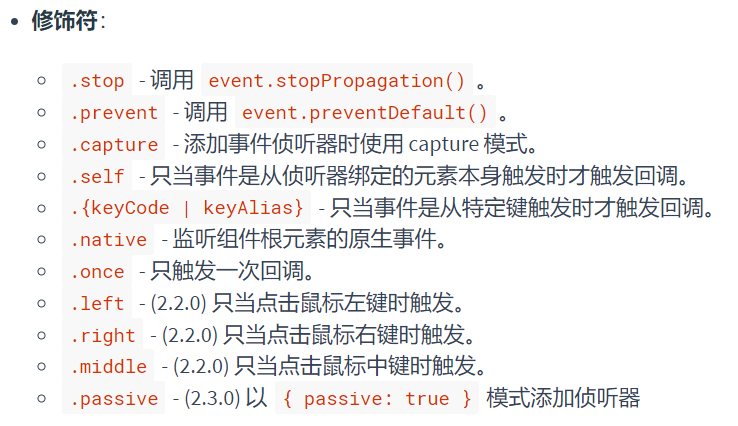

# 第 1 章 基础知识

> 准确地说这完全称不上一份标准的入门教程，只是对其中比较关键的和容易出错的内容进行解释。需要查看详尽文档请移步[vue 官方文档](https://cn.vuejs.org/v2/guide/)

## 1、语言规范

总结`vue`的基本语法规则能减少写出常见的 bug 以及快速与其他框架相区分。

- 在`template`中使用`vm`实例上的内容不需要`this`，在`script`中需要。
- vue 的指令为`v-directive="value"`或者`v-directive:argument="value"`的格式。`。
- 标签的属性中需要写变量时必须使用`v-bind`，值的最外层引号是语法规定，不是字符意义的引号。
- data 是个函数，不是对象。
- 不要给实例选项传递箭头函数。
- vue 响应式只包含实例创建时就存在的数据及其属性。
- 需要时尽量使用`<template/>`，生成的代码中不会包含该元素。

## 2、指令

### (1) 基本指令

- v-if
- v-for
- v-model
- v-show
- v-html
- v-bind
- v-on
- v-text
- v-slot
- v-pre
- v-cloak
- v-once

### (2) 说明

- v-bind:[动态参数]="value"可用。
- v-on:<动作>.<修饰符>可用。
- `v-if`直接控制 dom 元素是否被生成，而`v-show`只是控制`display`属性，切换时不卸载组件实例(而`visibility: hidden`只是视觉上不可见)。详情可查看：[v-if 与 v-show](https://vue3js.cn/interview/vue/show_if.html#%E4%B8%89%E3%80%81v-show%E4%B8%8Ev-if%E5%8E%9F%E7%90%86%E5%88%86%E6%9E%90)
- vue 会尽量高效地复用元素，可以给元素声明不同的`key`来强制替换。可以使用改变`key`的方式强制重新加载子组件。
- `v-for`的标准格式：` <li v-for="(item, index) in items" :key="item.key"></li>`，也能遍历对象。
- 我们可能会需要有选择地使用`v-for`内容，不要把`v-if`与之写在同一元素上，使用`template`。
- `v-on`给调用方法传递特殊变量`$event`，访问原始的`dom事件`。
- `v-model`修饰符：

  - `.lazy`：使得`视图->状态`的同步在`change`时而不是`input`时触发。

  - `.number`：使得输入转化为数值来同步。

  - `.trim`：使得自动过滤输入的首尾空白字符。

:::tip 补充

  

:::
、

### (3) 自定义指令

```js
// 注册一个全局自定义指令 `v-focus`
Vue.directive("focus", {
  // 当被绑定的元素插入到 DOM 中时……
  inserted: function (el) {
    // 聚焦元素
    el.focus();
  },
});
```

除此之外，也能通过`directives`选项定义局部指令。

## 3、事件

使用`v-on`可以在组件上，注意默认会传递`$event`给处理方法，只需要占位获取即可。
同时还有其他几种手动处理的实例属性：

- `$on`：用来手动绑定事件
- `$once`：绑定事件一次
- `$off`：解除绑定

考虑如下一个场景，我们需要在组件摧毁前释放第三方库对象：
可以直接在生命周期钩子执行，但此时的缺点是必须把临时使用的对象挂载到`data`。

```js
// 一次性将这个日期选择器附加到一个输入框上
// 它会被挂载到 DOM 上。
mounted: function () {
  // Pikaday 是一个第三方日期选择器的库
  this.picker = new Pikaday({
    field: this.$refs.input,
    format: 'YYYY-MM-DD'
  })
},
// 在组件被销毁之前，
// 也销毁这个日期选择器。
beforeDestroy: function () {
  this.picker.destroy()
}
```

这时候就可以使用`$once`来解决：

```js
mounted: function () {
  var picker = new Pikaday({
    field: this.$refs.input,
    format: 'YYYY-MM-DD'
  })

  this.$once('hook:beforeDestroy', function () {
    picker.destroy()
  })
}
```

还有注册和清除定时器的场景：

```js
mounted(){
  const timer = setInterval(()=>{}, 1000);
  this.$once('hook:beforeDestroy',()=>{
    clearInterval(timer);
  })
}
```

## 4、生命周期

- 初始化阶段：实例初始化执行环境，完成后触发`beforeCreate`。之后将`data`注入到响应式系统中，并设置`watch`、`methods`和`computed`等实例选项，完成后触发`created`；
- 模板编译和挂载阶段：首先将模板解析为`render`函数（AST 树），完成后触发`beforeMount`。（:bell: 注意此时如果有子组件，开始触发子组件实例的生命周期，以此类推，因为父组件依赖子组件，子组件不准备好父组件无法生成虚拟 dom）之后通过`h()`函数将实例中的数据上树，此时就生成了`VNode`，即虚拟 dom，它是 dom 结构的一种简化表示，有利于响应式依赖的收集和变更通知，同时也利于后续的`diff`操作。之后将虚拟 dom 转化为真实 dom，即`this.$el`，并取代`el`选项指定的真实 dom。完成后触发`mounted`。
- 更新阶段：当状态发生改变，触发`beforeUpdate`，通知依赖变更状态，生成新的虚拟 dom，对比变更前后的虚拟 dom，最小量更新真实 dom 元素。完成后触发`updated`
- 销毁阶段：当组件销毁时首先触发`beforeDestory`，此钩子函数应该进行一些自定义对象清理，之后会自动清理实例选项，并等待子组件摧毁结束，以此类推。全部完成才会触发`destoryed`。


## 5、computed 和 watch

因为在模板中写表达式难以维护和复用，且 vue 本身不支持复杂的插值运算。此时可以借助`method`来实现，但性能上还是计算属性更好些，因为**计算属性是基于它们的响应式依赖进行缓存的**。只在相关响应式依赖发生改变时它们才会重新求值。

> 如果该计算属性依赖的内容不是响应式依赖，则不会自动触发更新计算操作，如`Date.now()`等。

而`watch`是的功能在于监听。

:warning: 注意`watch`默认无法深度监听，只有监听的对象重新赋值才会触发，可以手动开启深度监听：

```js
watch: {
    data: {
        handler: function(newVal, oldVal){
            ...
        },
        deep: true
    },
}
```

> 当被监听的对象被修改时，深度监听会起作用，但是却无法获取`oldVal`，一种可行的方案是把监听的对象序列化为`computed`，再去监听该`computed`，可参考[这篇文章](https://blog.csdn.net/qq_35859392/article/details/107552326)。

## 6、组件

### (1) 组件注册和使用

全局注册使用`Vue.component('my-component-name', {})`，注意一定在实例创建前就注册。局部注册使用`components`选项。

> 当使用`PascalCase`注册一个组件名时，可以使用`PascalCase`和`kebab-case`两种方式在模板中引用组件。关于在模板传递`props`时，官方网站说只能用`kebab-case`，但我用`camelCased`也没发现问题，这点暂时存疑。

:::warning
要注意区分`注册组件名`、`定义组件名`和`路由别名`。定义组件名在使用`vue-devtool`调试时显示，`路由别名`用于快捷路由快捷引用。
:::

补充一个目录下组件全局注册的的方案：

```js
import Vue from "vue";
import upperFirst from "lodash/upperFirst";
import camelCase from "lodash/camelCase";

const requireComponent = require.context(
  // 其组件目录的相对路径
  "./components",
  // 是否查询其子目录
  false,
  // 匹配基础组件文件名的正则表达式
  /Base[A-Z]\w+\.(vue|js)$/
);

requireComponent.keys().forEach((fileName) => {
  // 获取组件配置
  const componentConfig = requireComponent(fileName);

  // 获取组件的 PascalCase 命名
  const componentName = upperFirst(
    camelCase(
      // 获取和目录深度无关的文件名
      fileName
        .split("/")
        .pop()
        .replace(/\.\w+$/, "")
    )
  );

  // 全局注册组件
  Vue.component(
    componentName,
    // 如果这个组件选项是通过 `export default` 导出的，
    // 那么就会优先使用 `.default`，
    // 否则回退到使用模块的根。
    componentConfig.default || componentConfig
  );
});
```

### (2) 组件通信

#### props 和 $emit

一般情况下，父->子 使用`props`，子->父 使用`$emit`。不同数据类型的传递方式符合函数传参规则。

> `props`传递的数据不建议在子组件中修改，可以使用`.sync`修饰，此时才能被响应系统检测到。

#### 特殊变量

使用`$root`访问根实例，使用`$parent`访问父组件，使用`$childen`访问子组件列表，使用`$refs.name`访问指定子元素。

> :warning: `$refs`不支持响应式。

#### 依赖注入

`provide`和`inject`选项。

```js
// 祖先组件
provide: function () {
  return {
    getMap: this.getMap
  }
}

// 孩子组件
inject: ['getMap']
```

#### $attrs 和 $listener

当非`props`被声明在子组件时时，默认情况下这些属性将作为`dom属性`作用到子组件的根元素上，并会替换已有的属性（class 和 style 采取合并策略）。可以开启`inheritAttrs: false`选项阻止这种可能的破坏。此时传递的属性在子组件中可以通过`this.$attrs`获取。
显然这又是一种组件通信的方式，而且是多层次的，因为子组件还能通过`v-bind:$attrs`再传递给孙子组件。从而实现了从祖先到孩子的数据传递。
那么从孩子到祖先的通信该怎么实现呢？有个`$listeners`实例属性，其中保存有所有的父组件的监听器。通过在中间组件使用`v-on:$listener`中转祖先组件的监听器，就能在任意孩子组件中使用`$emit`直接触发。
可见这种方式是对多层级的`props`、`$emit`通信模式的简化，从效果上来看，实现的是**祖先元素和所有子孙元素间**的通信。

### (3) 插槽

合理地拆分组件和用好插槽复用代码的关键。
在子组件中使用`<slot>`标签声明默认插槽，提供`name`属性声明具名插槽。

#### 具名插槽

```html
<base-layout>
  <template v-slot:header>
    <h1>Here might be a page title</h1>
  </template>

  <p>A paragraph for the main content.</p>
  <p>And another one.</p>

  <template v-slot:footer>
    <p>Here's some contact info</p>
  </template>
</base-layout>
```

> 没有使用`v-slot`指令的内容占位默认插槽，其中`v-slot:`可简写为`#`。

#### 作用域插槽

插槽的填充内容默认无法访问子组件作用域的内容。
可以通过给`slot`标签使用`v-bind`指令向外暴露内容，之后父组件的填充内容使用对象来接收：

```html
<current-user>
  <template v-slot:default="slotProps">
    {{ slotProps.user.firstName }}
  </template>
</current-user>
```

### (4) 动态组件

```html
<component v-bind:is="currentTabComponent"></component>
```

> 这其实是`v-if-else`的一种语法糖。
> 同理还有`v-show`的语法糖：

```html
<!-- 失活的组件状态将会被缓存！-->
<keep-alive>
  <component v-bind:is="currentTabComponent"></component>
</keep-alive>
```

### (5) 递归组件

实现起来并不难，组件自己调用自己即可，注意这种情况下组件的`name`不可省略。标签名不能用`驼峰命名`而应该用`连接线`，标签属性要用`纯小写`，据说这是`W3C`的规范，但试了一下并没有影响。

### (6) 混入

混入 (mixin) 提供了一种非常灵活的方式，来分发 Vue 组件中的可复用功能。一个混入对象可以包含任意组件选项。当组件使用混入对象时，所有混入对象的选项将被“混合”进入该组件本身的选项。

```js
// 定义一个混入对象
var myMixin = {
  created: function () {
    this.hello();
  },
  methods: {
    hello: function () {
      console.log("hello from mixin!");
    },
  },
};

// 定义一个使用混入对象的组件
var Component = Vue.extend({
  mixins: [myMixin],
});

var component = new Component(); // => "hello from mixin!"
```

> `Vue.extend`用来定义 Vue 子类，声明的组件对象需要使用`el`选项或者`$mount`挂载到 dom 上使用，只是一种动态生成组件的方式，很多`message`组件就是这样生成的。
> 同名钩子函数将合并为一个数组，因此都将被调用。另外，混入对象的钩子将在组件自身钩子之前调用。

除此之外还能使用`Vue.mixin()`全局混入。

```vue
<template>
  <div>
    <div class="title">
      {{ data.name }}
    </div>
    <div class="children" v-if="data.children">
      <detailed-list
        v-for="(item, index) in data.children"
        :key="index"
        :data="item"
      ></detailed-list>
    </div>
  </div>
</template>

<script>
export default {
  name: "DetailedList",
  props: {
    data: Object,
  },
};
</script>

<style scoped>
.children {
  padding: 0 20px;
}
</style>
```

## 7、过渡 & 动画

这个相当于`vue`给组件使用 css 动效提供了一种更简单、强大的方式。这东西还挺复杂的。
[过渡](https://cn.vuejs.org/v2/guide/transitions.html#%E6%A6%82%E8%BF%B0)

## 8、补充

### (1) 开发插件

```js
MyPlugin.install = function (Vue, options) {
  // 1. 添加全局方法或 property
  Vue.myGlobalMethod = function () {
    // 逻辑...
  }

  // 2. 添加全局资源
  Vue.directive('my-directive', {
    bind (el, binding, vnode, oldVnode) {
      // 逻辑...
    }
    ...
  })

  // 3. 注入组件选项
  Vue.mixin({
    created: function () {
      // 逻辑...
    }
    ...
  })

  // 4. 添加实例方法
  Vue.prototype.$myMethod = function (methodOptions) {
    // 逻辑...
  }
}
```

`Vue.use()`会自动执行插件对象的`install`方法。

## 问题

### (1) 为什么 data 非要是函数不可？

首先说明，`根vue实例`的 data 是可以直接写成一般对象的，因为根只存在一个，不会复用，而组件是会被复用的。为什么被复用就不行呢？原因如下：

这和 vue 实例被创建的过程有关，vue 实例初始化后会把代码中`data`的内容作为属性添加到`vm`上，之后也会把函数之类的内容添加进来，所以我们才能通过`this.属性`的形式访问到。如果写成对象的形式，相同组件在多个位置使用会共享`data`，因为对象是`引用类型`，每次被挂载还是原来对象的引用。

### (2) v-model 的实现机制？

`v-model`双向绑定是 vue 的语法糖，可以通过`v-bind`和`v-on`联合实现（指视图->数据方向）：

```vue
<input v-model="searchText">
```

等价于：

```vue
<input
  v-bind:value="searchText"
  v-on:input="searchText = $event.target.value"
>
```

> `v-on`的值既能是`method`的名字，也能是单条语句，甚至是简单的箭头函数。

除此之外，自定义输入框组件也支持使用`v-model`语法糖，但需要在定义时就满足上述规则：

```js
Vue.component("custom-input", {
  props: ["value"],
  template: `
    <input
      v-bind:value="value"
      v-on:input="$emit('input', $event.target.value)"
    >
  `,
});
```

再者我们还能修改`v-model`默认的行为，这对使用`select`、`radio`、`checkbox`等控件时有用：

```js
Vue.component("base-checkbox", {
  model: {
    prop: "checked",
    event: "change",
  },
  props: {
    checked: Boolean,
  },
  template: `
    <input
      type="checkbox"
      v-bind:checked="checked"
      v-on:change="$emit('change', $event.target.checked)"
    >
  `,
});
```
