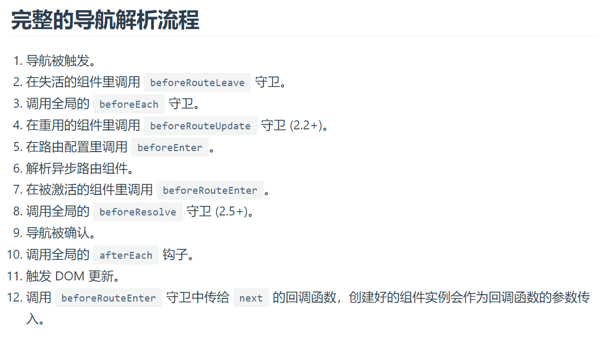

# 第2章 vue-router
## 1、浅谈前端路由

### （1）为什么需要前端路由？

`url`翻译过来叫做`统一资源定位符`，是下面这种格式`protocol://hostname[:port]/path/[:parameters][?query]#fragment`，除了最后的`fragment`，其对应着网络服务器的一条资源映射。前端路由与请求服务器资源无关（懒加载不提），但`SPA`的场景下是为了标识资源的展示和使用的动作。我们希望这些动作也能像纯`HTML`请求的应用一样被捕获到。最直观的感受是，我们希望页面改变的时候地址栏能改变，我们的浏览状态能被记录下来。

`AJAX`催化了`SPA`的产生，SPA催化了前端路由的产生，考虑不使用前端路由的`SPA`，完全不影响使用，但此时浏览器的前进后退按钮不再可用，历史记录不再能够被记录和保存，这对用户而言的体验是很差的，且当用户点击刷新页面时，页面会回退到网站初始的状态。这是不可忍受的。

那就给前端搞个路由吧。
### （2）如何实现前端路由？
#### ① hash模式
HTML的`hash`用于快速定位页面标题，在很久之前就开始支持，这里已经有了前后端分离的思想。

```html
<h1 id='your-title'>标题</h1>
...
<a class="headerlink" href="#your-title">回到标题</a>
```


浏览器地址栏中hash符号`#`之后的内容只用来匹配当前页面的链接元素的定位，在hash改变时不会向服务器发起请求，且会触发`hashchange`事件，这个事件也会导致浏览器保存历史记录状态。当开发者想要切换页面（dom状态）时，只需要通过`window.location.hash`切换个路由，同时监听这个路由的变化更新dom页面。只要你能维护好`hash`和`虚拟页面`的映射关系，这个方法完全可行地。

hash存在一些缺点：

- 地址栏显示不够优雅，多了个小尾巴，不像真的路由
- 路由间传参只能通过地址栏，很难看

hash具有缺点是很正常的，毕竟它的历史使命就不是用来做动态路由的。
于是有了`history`

#### ② history模式

`history`改善了`hash`的缺点，和普通`url`显示效果一致，同时可以使用专门的对象在路由间传递数据，功能也更强大。
但也存在一个明显的缺点，当修改地址栏路径时会向服务器重新请求资源（修改hash不会），所以服务器需要设置对于该请求的处理（一般重新返回单页面即可），在进入该单页面后在前端再响应地址栏的路由部分。
> `history`对象是浏览器全局对象`document`的子属性。
### （3）为什么需要vue-router？

vue-router插件是对js前端路由api的封装，同时提供强大的映射管理功能，是vue官方项目，同时有`hash`和`history`两种实现方式可用。

:::tip 提醒
后面的讲解主要按照`vue-router 3`来讲，`4`是专门给`vue3`来使用，变化不是特别大，之后在讲到vue3时一块说。
这儿有一篇对比的文章：[vue-router3和4差异](https://blog.csdn.net/wu_xianqiang/article/details/109910155)

因为`vue-router`是专门面向vue开发的插件，所以需要`Vue.use()`注册插件。又因为是官方插件，所以自定义配置信息需要在创建全局vue对象时作为参数传入。
:::

## 2、基本使用

### (1) 配置路由
> 所谓配置路由，本质就是按照`vue-router`可解析的格式定义`路由路径`和`视图`的映射关系。
```js
const router = new VueRouter({
  routes: [
    {
      path: '',
      component: {
        default: Home,
        a: Bar
      },
      name: 'home'
    },
    {
      path: '/user/:id',
      component: User,
      children: [
        {
          // 当 /user/:id/profile 匹配成功，
          // UserProfile 会被渲染在 User 的 <router-view> 中
          path: 'profile',
          component: UserProfile
        },
        {
          // 当 /user/:id/posts 匹配成功
          // UserPosts 会被渲染在 User 的 <router-view> 中
          path: 'posts',
          component: UserPosts
        }
      ]
    },
    {
      path: '*',
      redirect: ''
    }
  ]
})
```
> 上面用同时用到了`命名路由`、`动态路由`、`嵌套路由`和`命名视图`，后面会一一介绍。
### (2) 使用

#### ① 链接方式
使用`router-link`静态链接方式。

```html
<router-link :to="{ name: 'user', params: { id: 123 }}">User</router-link>
```

这里就用到了前面说的`name`字段，此时我们可以自由地传递任何对象，并在`this.$route.params`中获取到。
或者使用绝对路径的方式：
```html
<router-link :to="/user/123">User</router-link>
```
#### ② 编程式
直接动态操作`router`对象。

```js
this.$router.push({ name: 'user', params: { userId: 123 } })
```
:warning: 注意`params`是属于`path`的一部分，看起来和路由没啥区别，要注意和`query`做区分。就`vue-router`而言：`name` + `params` = `path`; `path` + `query` = `location`;
- router.push(location, onComplete?, onAbort?)
- router.replace(location, onComplete?, onAbort?)
- router.go(n)

> n 是整数，代表前进或后退的步数
### (3) 命令路由
其实前面已经用到了，就是定义路由时起个名字，之后链接或跳转时比较方便。
### (4) 动态路由
动态路由的主要目的是为了把某种模式匹配到的所有路由，全都映射到同个组件。所以尽量不要把它作为路由通信。可以通过`this.$route.params['name']`获取匹配的参数。

:warning: 当使用路由参数时，例如从 `/user/foo` 导航到 `/user/bar`，**原来的组件实例会被复用**。因为两个路由都渲染同个组件，比起销毁再创建，复用则显得更加高效。**不过，这也意味着组件的生命周期钩子不会再被调用**。复用组件时，想对路由参数的变化作出响应的话，你可以简单地 watch (监测变化) `$route` 对象：

```js
  watch: {
    $route(to, from) {
      // 对路由变化作出响应...
    }
  }
```

或者使用导航守卫`beforeRouteUpdate()`：

```js
beforeRouteUpdate(to, from, next) {
    // react to route changes...
    // don't forget to call next()
  }
```

### (5) 嵌套路由

前面已经用到了嵌套路由。子路由的视图会显示在父视图中的`router-view`标签。
> 注意子路由的路径写法，写成相对路径即可

### (6) 命名视图
前面讲的都是在单个页面使用一个`router-view`标签，有时候我们同时需要多个，尽管我是没用过这么奇葩的场景。
```vue
<router-view class="view one"></router-view>
<router-view class="view two" name="a"></router-view>
<router-view class="view three" name="b"></router-view>
```
最上面的是默认的，相当于省略了`name='default`，之后给`component`选项中分别指定视图即可。

## 3、路由通信

### (1) params方式 :star:
这种最常用，无论是直接拼接path使用`path`还是使用`name`加`params`。
动态路由占位会首先匹配其中的属性，当匹配不到时，不会在地址栏显示，但传递的参数依然是可获取的，也支持传递复杂对象。
之后通过`this.$router.params`读取即可。
所以说`动态路由`和`params传参`并不是耦合的，这点设计比较好。

### (2) query 方式
前面说过：`path` + `query` = `location`
通过query传递的内容一定会在地址栏显示出来。
之后通过`this.$router.query`获取即可。

### (3) hash 方式

```js
this.$router.push('/details/001#car')
this.$router.push({ path: '/details/001', hash: '#car'})
this.$router.push({ name: 'details', params: { id: '001' }, hash: 'car'})
```

获取参数时需要使用`$route.hash.slice(1)`，太垃圾了。最好不用。

### （4）关于如何接收路由传递的参数
#### ① $router

一般情况下我们通过下面这种方式接收：

```js
this.$route.params['name']
```

> 这样有些缺点，就是我们在没有确保来源路由一定给我们传递了什么东西的前提下就开始使用了这个参数。这不太合适。于是我们可以开启`props`，就是把可能传递的参数都挂挂载到`props`选项中，是个解耦的过程。


```js
const router = new VueRouter({
  routes: [
    { path: '/user/:id', component: User, props: true },
  ]
})
```

这种方式叫做`布尔模式`，`this.$route.params` 将会被设置为组件的属性（像`组件传值`一样）。

如果我们需要通过路由给组件传递静态值，可以使用`对象模式`：

```js
props: { newsletterPopup: false }
```

除此之外我们还能对传递的参数预先格式化处理，即采用`函数模式`，此时可以操作整个`route`对象：

```js
props: route => ({ query: route.query.q })
```
> 此时就把`q`这个`query`内容挂载为名为`query`的`prop`。

## 4、导航守卫

### （1）全局守卫

在`router`实例上配置。

#### ① router.beforeEach() :star:

全局前置守卫，在所有导航守卫中优先级最高。

```js
router.beforeEach((to, from, next) => {
  if (to.name !== 'Login' && !isAuthenticated) next({ name: 'Login' })
  else next()
})
```

> 确保`next()`一定被调用且仅调用一次。`next(false)`会重回`form`路由。
>
> #### ② router.beforeResolve()	

 `router.beforeResolve()` 注册一个全局守卫。这和 `router.beforeEach` 类似，区别是在导航被确认之前，**同时在所有组件内守卫和异步路由组件被解析之后**，解析守卫就被调用。

#### ③ router.afterEach()

全局后置钩子。

和守卫不同，此时导航已经完成，所以这些钩子不会接受 `next` 函数也不会改变导航本身。只是做一些额外的处理工作。

### （2）路由守卫

```js
 {
      path: '/foo',
      component: Foo,
      beforeEnter: (to, from, next) => {
        // ...
      }
    }
```

这个在路由中配置，相当于对到达该路由时进行更加精细化的配置，这里的`to`没意义。

### （3）组件守卫

为什么需要组件守卫路由呢？是因为对于动态路由会复用组件实例，组件声明周期不会重新触发。

> 注意只有组件有对应路由时才需要定义导航守卫，不然根本不会触发。

#### ① beforeRouteEnter

```js
  beforeRouteEnter(to, from, next) {
    // 在渲染该组件的对应路由被 confirm 前调用
    // 不！能！获取组件实例 `this`
    // 因为当守卫执行前，组件实例还没被创建
  }
```

该钩子在新组件实例被创建前调用，所以无法在其中访问到`this`，可以在`next()`中通过回调函数访问。（:warning:只有这个守卫支持这种写法）

```js
beforeRouteEnter (to, from, next) {
  next(vm => {
    // 通过 `vm` 访问组件实例
  })
}
```

#### ② beforeRouteUpdate

这个就是为了前面说的动态路由时使用。可以在其中获取到新的路由参数。

```js
beforeRouteUpdate (to, from, next) {
  // just use `this`
  this.name = to.params.name
  next()
}
```

#### ③ beforeRouteLeave

导航离开该组件对应的路由时触发，可以用来提醒用户保存界面信息。

```js
beforeRouteLeave (to, from, next) {
  const answer = window.confirm('Do you really want to leave? you have unsaved changes!')
  if (answer) {
    next()
  } else {
    next(false)
  }
}
```



## 5、路由懒加载

```js
const Foo = () => import('./Foo.vue')

const router = new VueRouter({
  routes: [{ path: '/foo', component: Foo }]
})
```
此时会把异步的组件打包都独立的chunk中。

通过使用`webpack`提供的`命名chunk`功能，还能指定哪些组件打包到相同的块中：
```js
const Foo = () => import(/* webpackChunkName: "group-foo" */ './Foo.vue')
const Bar = () => import(/* webpackChunkName: "group-foo" */ './Bar.vue')
const Baz = () => import(/* webpackChunkName: "group-foo" */ './Baz.vue')
```

## 6、滚动行为

对于单页面应用而言，切换路由并不会改变原来页面的滚动位置。
```js
const router = new VueRouter({
  routes: [...],
  scrollBehavior (to, from, savedPosition) {
    // return 期望滚动到哪个的位置
  }
})
```
实现的原理就是跳转新路由时重置`window.scrollTo`到指定位置，同时`popstate `也会被`hsitory`保存下来，所以要求浏览器必须支持`history.pushState`。

更多相关配置：[scrollBehavior](https://v3.router.vuejs.org/zh/guide/advanced/scroll-behavior.html#%E5%BC%82%E6%AD%A5%E6%BB%9A%E5%8A%A8)

